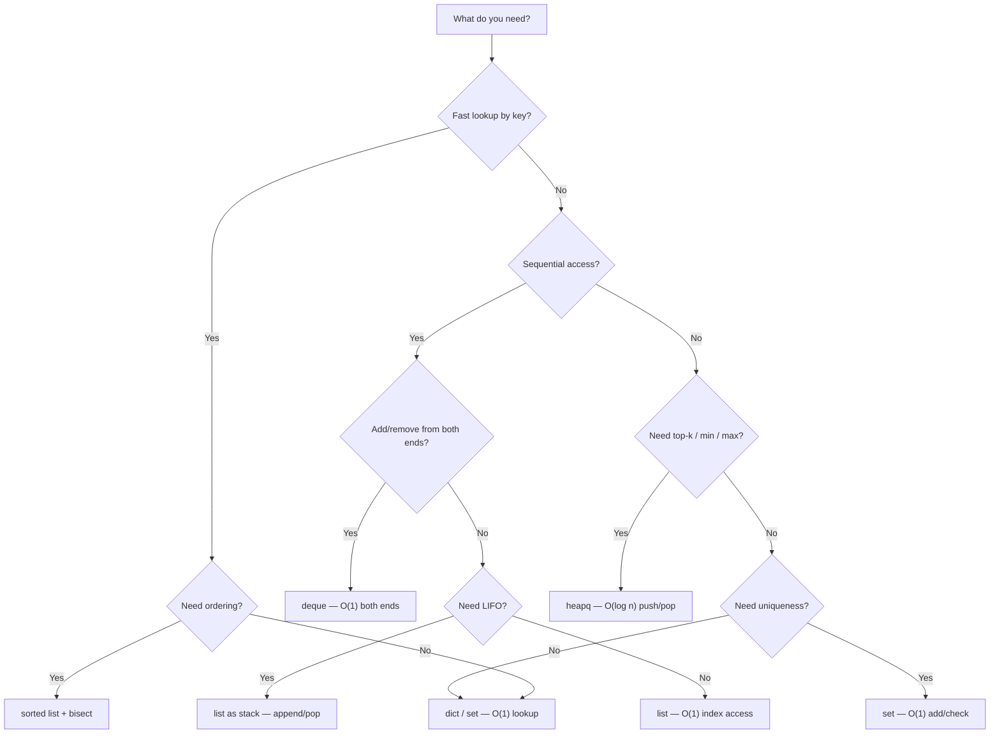

# Python for DSA — Quick Reference

## Built-in Data Structures & Big-O

### List (Dynamic Array)

| Operation | Syntax | Time |
|---|---|---|
| Access by index | `nums[i]` | O(1) |
| Append | `nums.append(x)` | O(1) |
| Pop from end | `nums.pop()` | O(1) |
| Pop from front | `nums.pop(0)` | **O(n)** |
| Insert at front | `nums.insert(0, x)` | **O(n)** |
| Insert at index | `nums.insert(i, x)` | **O(n)** |
| Membership check | `x in nums` | **O(n)** |
| Slice | `nums[a:b]` | O(b - a) |
| Sort | `nums.sort()` | O(n log n) |
| Length | `len(nums)` | O(1) |

### Dict (Hash Map)

| Operation | Syntax | Time |
|---|---|---|
| Get / Set | `d[key]` / `d[key] = val` | O(1) |
| Delete | `del d[key]` | O(1) |
| Membership | `key in d` | O(1) |
| Get with default | `d.get(key, default)` | O(1) |
| Keys / Values | `d.keys()` / `d.values()` | O(n) |

### Set

| Operation | Syntax | Time |
|---|---|---|
| Add | `s.add(x)` | O(1) |
| Remove | `s.remove(x)` | O(1) |
| Membership | `x in s` | O(1) |
| Union | `a \| b` | O(len(a) + len(b)) |
| Intersection | `a & b` | O(min(len(a), len(b))) |
| Difference | `a - b` | O(len(a)) |

### String (Immutable)

| Operation | Syntax | Time |
|---|---|---|
| Access char | `s[i]` | O(1) |
| Slice | `s[a:b]` | O(b - a) |
| Concatenation | `s + t` | **O(n + m)** |
| Join | `''.join(lst)` | O(total chars) |
| Find / In | `s.find(t)` / `t in s` | O(n * m) |
| Replace | `s.replace(a, b)` | O(n) |

---

## `collections` Module

### Counter

```python
from collections import Counter
c = Counter("aabbc")        # Counter({'a': 2, 'b': 2, 'c': 1})
c.most_common(2)            # [('a', 2), ('b', 2)]
c['a']                      # 2
c1 - c2                     # subtract counts
```

### defaultdict

```python
from collections import defaultdict
groups = defaultdict(list)
groups['key'].append(val)   # no KeyError if key missing
```

### deque (Double-Ended Queue)

```python
from collections import deque
dq = deque([1, 2, 3])
dq.append(4)               # O(1) add right
dq.appendleft(0)           # O(1) add left
dq.pop()                   # O(1) remove right
dq.popleft()               # O(1) remove left
```

### heapq (Min Heap)

```python
import heapq
heapq.heapify(nums)        # O(n) — build min-heap in place
heapq.heappush(nums, x)    # O(log n)
heapq.heappop(nums)        # O(log n) — pops smallest
heapq.nlargest(k, nums)    # O(n log k)
heapq.nsmallest(k, nums)   # O(n log k)
# Max heap trick: push -val, pop and negate
```

---

## Essential Patterns

### enumerate — index + value

```python
for i, val in enumerate(nums):
    print(i, val)
```

### zip — parallel iteration

```python
for a, b in zip(list1, list2):
    print(a, b)
d = dict(zip(keys, values))
```

### List comprehension

```python
squares = [x**2 for x in range(10)]
evens = [x for x in nums if x % 2 == 0]
flat = [x for row in matrix for x in row]
```

### Sorting with key

```python
sorted(words, key=len)                    # by length
sorted(words, key=lambda w: w[-1])        # by last char
sorted(words, key=lambda w: (len(w), w))  # multi-key
nums.sort(reverse=True)                   # descending
```

### Swap (no temp variable)

```python
a, b = b, a
nums[i], nums[j] = nums[j], nums[i]
```

---

## String Tricks

```python
ord('a')          # 97    — char → int
chr(97)           # 'a'   — int → char
ord(c) - ord('a') # alphabet position (0-indexed)

s.isalnum()       # letters + digits only?
s.isalpha()       # letters only?
s.isdigit()       # digits only?
s.lower()         # lowercase
s.upper()         # uppercase

'  ab  '.strip()  # 'ab'
'a,b,c'.split(',')# ['a', 'b', 'c']
','.join(['a','b'])# 'a,b'

list(s)           # string → char list (for mutation)
''.join(chars)    # char list → string
s[::-1]           # reverse string
```

---

## Counting Patterns

```python
# Method 1: manual
count = {}
for x in items:
    count[x] = count.get(x, 0) + 1

# Method 2: Counter (preferred)
from collections import Counter
count = Counter(items)

# Frequency array (for lowercase letters)
freq = [0] * 26
for c in s:
    freq[ord(c) - ord('a')] += 1
```

---

## Decision Flowchart — Which Data Structure?



---

## Common Mistakes

| Mistake | Why it's bad | Fix |
|---|---|---|
| `x in list` inside a loop | O(n) per check → O(n²) total | Use `set` for O(1) lookup |
| `list.insert(0, x)` in a loop | O(n) per insert | Use `deque.appendleft()` |
| String concatenation in loop | Creates new string each time → O(n²) | Collect in list, `''.join()` |
| Modifying list while iterating | Skips elements or infinite loop | Iterate over a copy or build new list |
| Forgetting `dict.get(k, default)` | Verbose if/else for missing keys | `.get()` or `defaultdict` |
