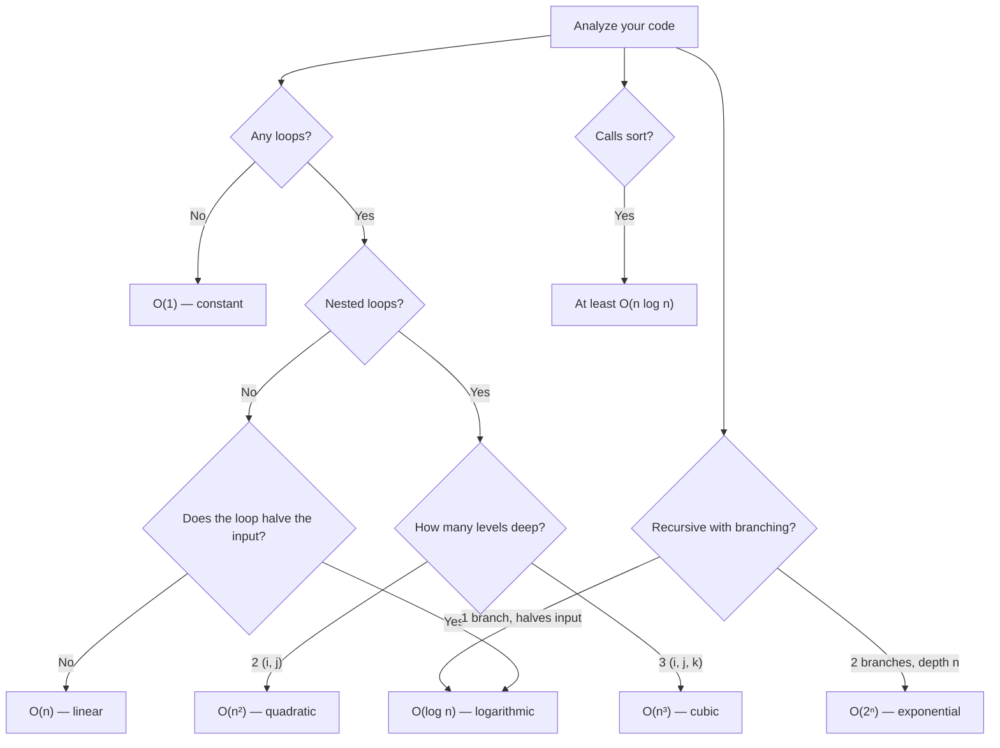

# Big-O & Complexity — Quick Reference

## The Hierarchy (Fastest → Slowest)

| Big-O | Name | Example | n=1M ops |
|---|---|---|---|
| O(1) | Constant | Array index, dict lookup | 1 |
| O(log n) | Logarithmic | Binary search | ~20 |
| O(n) | Linear | Single loop / scan | 1M |
| O(n log n) | Linearithmic | Sorting (merge sort, timsort) | ~20M |
| O(n²) | Quadratic | Nested loops / all pairs | 1T |
| O(2ⁿ) | Exponential | All subsets | ∞ |
| O(n!) | Factorial | All permutations | ∞ |

---

## Growth Comparison Table

| n | O(1) | O(log n) | O(n) | O(n log n) | O(n²) |
|---|---|---|---|---|---|
| 10 | 1 | 3 | 10 | 33 | 100 |
| 100 | 1 | 7 | 100 | 664 | 10K |
| 1,000 | 1 | 10 | 1K | 10K | 1M |
| 10,000 | 1 | 13 | 10K | 133K | 100M |
| 100,000 | 1 | 17 | 100K | 1.7M | 10B |
| 1,000,000 | 1 | 20 | 1M | 20M | 1T |

> At 1 billion ops/sec: O(n²) at n=1M takes **~17 minutes**. O(n log n) takes **0.02 seconds**.

---

## The 4 Rules

| Rule | Example | Result |
|---|---|---|
| **Drop constants** | O(2n), O(100n) | O(n) |
| **Keep dominant term** | O(n² + n + 1) | O(n²) |
| **Sequential → ADD** | Loop A then Loop B | O(A + B) |
| **Nested → MULTIPLY** | Loop A inside Loop B | O(A × B) |

---

## Common Operations Big-O

### Python Built-ins

| Operation | Time | Space |
|---|---|---|
| `list[i]` | O(1) | — |
| `list.append()` / `.pop()` | O(1) | — |
| `list.insert(0)` / `.pop(0)` | O(n) | — |
| `x in list` | O(n) | — |
| `list.sort()` / `sorted()` | O(n log n) | O(n) |
| `dict[key]` / `set.add()` | O(1) | — |
| `x in dict` / `x in set` | O(1) | — |
| `heapq.heappush/pop` | O(log n) | — |
| `deque.appendleft/popleft` | O(1) | — |

### Algorithms

| Algorithm | Time | Space |
|---|---|---|
| Linear scan | O(n) | O(1) |
| Binary search | O(log n) | O(1) |
| Two pointers | O(n) | O(1) |
| Hash map lookup | O(n) build, O(1) query | O(n) |
| Sliding window | O(n) | O(1) or O(k) |
| Sorting + scan | O(n log n) | O(n) |
| BFS / DFS | O(V + E) | O(V) |

---

## Space Complexity Quick Guide

| Space | Meaning | Example |
|---|---|---|
| O(1) | Fixed variables only | Swap, counter, two pointers |
| O(n) | Extra structure ∝ input | Hash map, result list, stack |
| O(n²) | 2D matrix | Adjacency matrix, DP table |

> **Trade-off**: Using O(n) space (hash set) often drops time from O(n²) to O(n).

---

## Interview Constraints → Required Complexity

| Constraint (n ≤) | Target Time | Why |
|---|---|---|
| 20 | O(2ⁿ) or O(n!) | Brute force / backtracking OK |
| 500 | O(n³) | Triple nested loops OK |
| 3,000 | O(n²) | Double nested loops OK |
| 100,000 | O(n log n) | Sort-based or divide & conquer |
| 1,000,000 | O(n) | Single pass, hash map, sliding window |
| 10,000,000+ | O(n) or O(log n) | Binary search, math, O(1) formula |

> **Quick trick**: Look at the constraint, pick the fastest complexity that fits, then find a pattern that matches.

---

## Recognizing Complexity from Code

---

## Quick Identification Patterns

| Code Pattern | Big-O |
|---|---|
| Single variable ops, no loops | O(1) |
| Single `for` loop over n | O(n) |
| Two sequential `for` loops | O(n) — add, drop constant |
| Nested `for` loop (n × n) | O(n²) |
| Loop that halves (`n //= 2`, `lo/hi`) | O(log n) |
| Sort + single loop | O(n log n) |
| Loop inside a loop with halving | O(n log n) |
| Iterating all subsets | O(2ⁿ) |
| Iterating all permutations | O(n!) |

---

## Common Mistakes

| Mistake | Actual Complexity |
|---|---|
| "Two loops so it's O(n²)" | Sequential loops = O(n + n) = O(n) |
| "I used a dict so it's O(1)" | Building the dict is O(n); lookups are O(1) |
| "`x in list` is O(1)" | No — `x in list` is O(n); `x in set` is O(1) |
| "Recursion is always O(2ⁿ)" | Depends on branches and depth |
| Ignoring sort in analysis | `sort()` alone is O(n log n) |
| Forgetting space from recursion | Call stack uses O(depth) space |
