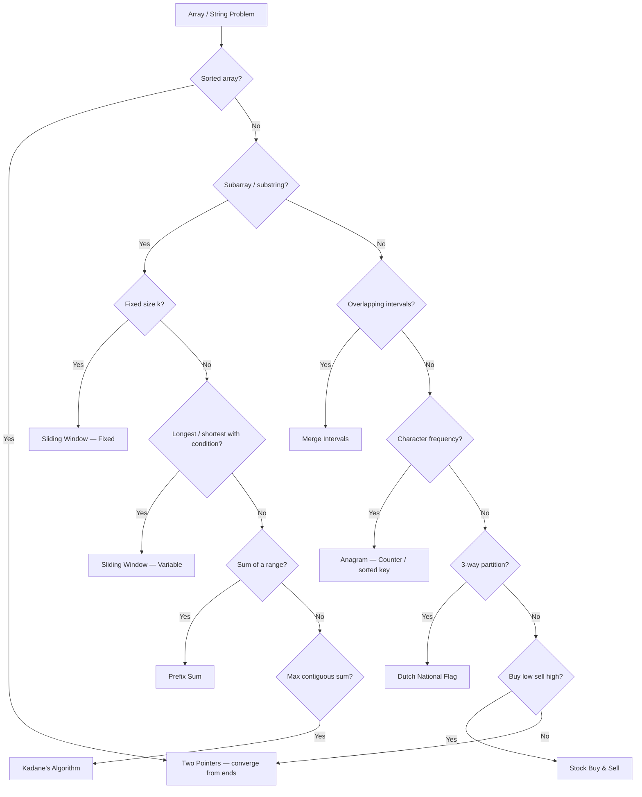

# Arrays & Strings — Quick Reference

## Pattern Decision Flowchart



---

## Pattern 1: Two Pointers

**When**: Sorted array, palindromes, pair sum, comparing from both ends

**Template**:

```python
def two_pointers(nums, target):
    left, right = 0, len(nums) - 1
    while left < right:
        current = nums[left] + nums[right]
        if current == target:
            return [left, right]
        elif current < target:
            left += 1
        else:
            right -= 1
    return []
```

**Intuition**: Sorted order lets us decide which pointer to move — too small? move left. Too big? move right.

| Metric | Value |
|---|---|
| Time | O(n) |
| Space | O(1) |
| LeetCode | 167, 125, 11, 15 |

---

## Pattern 2: Sliding Window (Fixed Size k)

**When**: Max/min/count over all contiguous subarrays of exact size k

**Template**:

```python
def fixed_window(nums, k):
    window = sum(nums[:k])
    best = window
    for i in range(k, len(nums)):
        window += nums[i] - nums[i - k]
        best = max(best, window)
    return best
```

**Intuition**: Build once, then slide — subtract the element leaving, add the element entering.

| Metric | Value |
|---|---|
| Time | O(n) |
| Space | O(1) |

---

## Pattern 3: Sliding Window (Variable Size)

**When**: Longest/shortest subarray satisfying a condition (no repeats, sum >= k, at most k distinct)

**Template**:

```python
def variable_window(nums):
    left = 0
    best = 0
    state = {}  # or set, counter, etc.
    for right in range(len(nums)):
        # expand: add nums[right] to state
        while window_is_invalid(state):
            # shrink: remove nums[left] from state
            left += 1
        best = max(best, right - left + 1)
    return best
```

**Intuition**: Each element enters and leaves the window at most once → O(n) total.

| Metric | Value |
|---|---|
| Time | O(n) |
| Space | O(k) or O(alphabet) |
| LeetCode | 3, 209, 76, 424 |

---

## Pattern 4: Prefix Sum

**When**: Range sum queries, count subarrays with sum = k

**Template — Range Queries**:

```python
prefix = [0] * (len(nums) + 1)
for i in range(len(nums)):
    prefix[i + 1] = prefix[i] + nums[i]
# sum(nums[i..j]) = prefix[j+1] - prefix[i]
```

**Template — Subarray Sum = k**:

```python
from collections import defaultdict
def subarray_sum(nums, k):
    count = 0
    current_sum = 0
    prefix_count = defaultdict(int)
    prefix_count[0] = 1
    for num in nums:
        current_sum += num
        count += prefix_count[current_sum - k]
        prefix_count[current_sum] += 1
    return count
```

**Intuition**: If `prefix[j] - prefix[i] = k`, then subarray `[i..j-1]` sums to k. Hash map finds matching prefixes in O(1).

| Metric | Value |
|---|---|
| Time | O(n) |
| Space | O(n) |
| LeetCode | 303, 560, 525 |

---

## Pattern 5: Kadane's Algorithm

**When**: Maximum (or minimum) contiguous subarray sum

**Template**:

```python
def max_subarray(nums):
    current = global_max = nums[0]
    for num in nums[1:]:
        current = max(num, current + num)
        global_max = max(global_max, current)
    return global_max
```

**Intuition**: At each element, decide — extend the current streak or start fresh? If the running sum is negative, it's better to start over.

| Metric | Value |
|---|---|
| Time | O(n) |
| Space | O(1) |
| LeetCode | 53 |

---

## Pattern 6: Dutch National Flag

**When**: Partition array into exactly 3 groups in one pass (e.g., sort 0s/1s/2s)

**Template**:

```python
def sort_three(nums):
    low, mid, high = 0, 0, len(nums) - 1
    while mid <= high:
        if nums[mid] == 0:
            nums[low], nums[mid] = nums[mid], nums[low]
            low += 1; mid += 1
        elif nums[mid] == 1:
            mid += 1
        else:
            nums[mid], nums[high] = nums[high], nums[mid]
            high -= 1
```

**Intuition**: Three pointers carve the array into `[0s | 1s | unknown | 2s]`. Don't advance `mid` on a swap with `high` — the swapped value is unknown.

| Metric | Value |
|---|---|
| Time | O(n) |
| Space | O(1) |
| LeetCode | 75 |

---

## Pattern 7: Merge Intervals

**When**: Overlapping ranges that need combining

**Template**:

```python
def merge(intervals):
    intervals.sort(key=lambda x: x[0])
    merged = [intervals[0]]
    for start, end in intervals[1:]:
        if start <= merged[-1][1]:
            merged[-1][1] = max(merged[-1][1], end)
        else:
            merged.append([start, end])
    return merged
```

**Intuition**: Sort by start. If current start <= previous end, they overlap — extend. Otherwise start a new group.

| Metric | Value |
|---|---|
| Time | O(n log n) |
| Space | O(n) |
| LeetCode | 56, 57, 986 |

---

## Pattern 8: Anagram Checking & Grouping

**When**: Character frequency comparison, grouping by character composition

**Template — Check Anagram**:

```python
from collections import Counter
def is_anagram(s, t):
    return Counter(s) == Counter(t)
```

**Template — Group Anagrams**:

```python
from collections import defaultdict
def group_anagrams(strs):
    groups = defaultdict(list)
    for s in strs:
        key = ''.join(sorted(s))
        groups[key].append(s)
    return list(groups.values())
```

**Intuition**: Same characters in any order = same sorted string = same Counter.

| Metric | Value |
|---|---|
| Time | O(n · k log k) where k = avg string length |
| Space | O(n · k) |
| LeetCode | 242, 49, 438 |

---

## Pattern 9: Stock Buy & Sell

**When**: Maximize profit from buying/selling over a price series

**Template — One Transaction**:

```python
def max_profit(prices):
    min_price = prices[0]
    max_profit = 0
    for price in prices:
        min_price = min(min_price, price)
        max_profit = max(max_profit, price - min_price)
    return max_profit
```

**Template — Unlimited Transactions**:

```python
def max_profit_unlimited(prices):
    return sum(max(0, prices[i] - prices[i-1]) for i in range(1, len(prices)))
```

**Intuition**: Track the minimum so far. At each day, the best profit is today's price minus the cheapest buy. For unlimited txns, collect every uphill.

| Metric | Value |
|---|---|
| Time | O(n) |
| Space | O(1) |
| LeetCode | 121, 122 |

---

## Bonus: Rotate Array (Reversal Trick)

```python
def rotate(nums, k):
    k %= len(nums)
    nums.reverse()
    nums[:k] = nums[:k][::-1]
    nums[k:] = nums[k:][::-1]
```

---

## Complexity Summary

| Pattern | Time | Space |
|---|---|---|
| Two Pointers | O(n) | O(1) |
| Sliding Window (Fixed) | O(n) | O(1) |
| Sliding Window (Variable) | O(n) | O(k) |
| Prefix Sum | O(n) | O(n) |
| Kadane's | O(n) | O(1) |
| Dutch National Flag | O(n) | O(1) |
| Merge Intervals | O(n log n) | O(n) |
| Anagram / Grouping | O(n · k log k) | O(n · k) |
| Stock Buy & Sell | O(n) | O(1) |

---

## Common Mistakes

| Mistake | Fix |
|---|---|
| Off-by-one in window boundaries | `range(k, len(nums))` — start AFTER initial window |
| Forgetting to handle empty / single element | Check `if not nums` or `len(nums) < 2` at the top |
| Shrinking variable window too much | Shrink only `while` invalid, not `if` invalid |
| Prefix sum off-by-one | `prefix[j+1] - prefix[i]` gives sum of `nums[i..j]` |
| Not sorting before merge intervals | Overlaps only detectable after sorting by start |
| Modifying string directly | Strings are immutable — convert to `list()` first |
| Using `==` on float results | Use integer arithmetic or `abs(a - b) < epsilon` |
