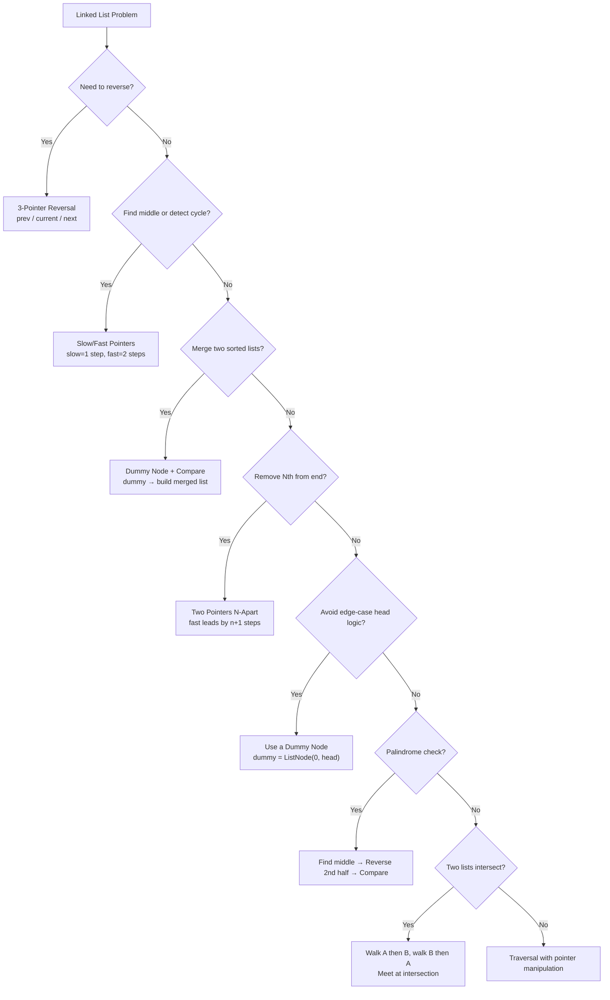

# Linked Lists — Quick Reference

## Node Structure

```python
class ListNode:
    def __init__(self, val=0, next=None):
        self.val = val
        self.next = next
```

## Array vs Linked List

| Operation | Array (list) | Linked List |
|---|---|---|
| Access by index | O(1) | **O(n)** |
| Insert at head | **O(n)** | O(1) |
| Insert at tail | O(1) amortized | O(1) with tail ptr |
| Delete (given node) | **O(n)** | O(1) |
| Search | O(n) | O(n) |
| Memory | Contiguous | Scattered (+ pointer overhead) |

---

## Core Operations

### Traversal

```python
current = head
while current:
    # process current.val
    current = current.next
```

### Insert at Head — O(1)

```python
def insert_head(head, val):
    node = ListNode(val)
    node.next = head
    return node  # new head
```

### Insert at Tail — O(n)

```python
def insert_tail(head, val):
    node = ListNode(val)
    if not head: return node
    curr = head
    while curr.next:
        curr = curr.next
    curr.next = node
    return head
```

### Delete by Value — O(n)

```python
def delete(head, val):
    if head and head.val == val:
        return head.next
    curr = head
    while curr and curr.next:
        if curr.next.val == val:
            curr.next = curr.next.next
            return head
        curr = curr.next
    return head
```

---

## Pattern Decision Flowchart



---

## Pattern 1: Reverse (3-Pointer Dance)

**When**: Reverse entire list or a portion

**Intuition**: Flip each arrow. Need 3 pointers: `prev` (new target), `current` (being flipped), `next_node` (saved so we don't lose the rest).

```python
def reverse(head):
    prev = None
    curr = head
    while curr:
        nxt = curr.next
        curr.next = prev
        prev = curr
        curr = nxt
    return prev  # new head
```

| Time | Space |
|---|---|
| O(n) | O(1) |

---

## Pattern 2: Slow/Fast Pointers

**When**: Find middle, detect cycle, find cycle start

### Find Middle

```python
def find_middle(head):
    slow = fast = head
    while fast and fast.next:
        slow = slow.next
        fast = fast.next.next
    return slow  # middle (2nd middle if even)
```

### Detect Cycle (Floyd's)

```python
def has_cycle(head):
    slow = fast = head
    while fast and fast.next:
        slow = slow.next
        fast = fast.next.next
        if slow == fast:
            return True
    return False
```

**Intuition**: In a cycle, fast gains 1 node per step on slow. The gap shrinks by 1 each iteration → they must meet.

| Time | Space |
|---|---|
| O(n) | O(1) |

---

## Pattern 3: Dummy Node

**When**: The head itself might change (insert/delete at head), or you want to avoid special-casing the first node

```python
def merge_two_lists(l1, l2):
    dummy = ListNode(0)
    tail = dummy
    while l1 and l2:
        if l1.val <= l2.val:
            tail.next = l1
            l1 = l1.next
        else:
            tail.next = l2
            l2 = l2.next
        tail = tail.next
    tail.next = l1 or l2
    return dummy.next
```

**Intuition**: Dummy avoids "which node is the head?" — just always append to `tail`, return `dummy.next`.

| Time | Space |
|---|---|
| O(n + m) | O(1) |

---

## Pattern 4: Two Pointers N-Apart

**When**: Remove Nth node from end in one pass

```python
def remove_nth_from_end(head, n):
    dummy = ListNode(0, head)
    fast = slow = dummy
    for _ in range(n + 1):
        fast = fast.next
    while fast:
        slow = slow.next
        fast = fast.next
    slow.next = slow.next.next
    return dummy.next
```

**Intuition**: When `fast` reaches `None`, `slow` is right before the target node. The `n+1` gap ensures `slow` lands one node before.

| Time | Space |
|---|---|
| O(n) | O(1) |

---

## Pattern 5: Palindrome Check

**When**: Check if linked list reads the same forwards and backwards

```python
def is_palindrome(head):
    # 1. Find middle
    slow = fast = head
    while fast and fast.next:
        slow = slow.next
        fast = fast.next.next
    # 2. Reverse second half
    prev = None
    while slow:
        nxt = slow.next
        slow.next = prev
        prev = slow
        slow = nxt
    # 3. Compare halves
    left, right = head, prev
    while right:
        if left.val != right.val:
            return False
        left = left.next
        right = right.next
    return True
```

| Time | Space |
|---|---|
| O(n) | O(1) |

---

## Pattern 6: Intersection of Two Lists

```python
def get_intersection(headA, headB):
    pA, pB = headA, headB
    while pA != pB:
        pA = pA.next if pA else headB
        pB = pB.next if pB else headA
    return pA  # intersection node or None
```

**Intuition**: Both pointers travel `len(A) + len(B)` total. They sync up at the intersection point.

| Time | Space |
|---|---|
| O(n + m) | O(1) |

---

## Pattern 7: Add Two Numbers

```python
def add_two_numbers(l1, l2):
    dummy = ListNode(0)
    curr = dummy
    carry = 0
    while l1 or l2 or carry:
        v1 = l1.val if l1 else 0
        v2 = l2.val if l2 else 0
        total = v1 + v2 + carry
        carry = total // 10
        curr.next = ListNode(total % 10)
        curr = curr.next
        l1 = l1.next if l1 else None
        l2 = l2.next if l2 else None
    return dummy.next
```

| Time | Space |
|---|---|
| O(max(n, m)) | O(max(n, m)) |

---

## Complexity Summary

| Operation / Pattern | Time | Space |
|---|---|---|
| Traversal | O(n) | O(1) |
| Insert at head | O(1) | O(1) |
| Insert at tail (no tail ptr) | O(n) | O(1) |
| Delete (given prev) | O(1) | O(1) |
| Reverse | O(n) | O(1) |
| Find middle | O(n) | O(1) |
| Detect cycle | O(n) | O(1) |
| Merge two sorted | O(n + m) | O(1) |
| Remove Nth from end | O(n) | O(1) |

---

## Common Mistakes

| Mistake | Why it breaks | Fix |
|---|---|---|
| Losing the head pointer | Traversal overwrites `head` | Use a separate `curr = head` |
| Forgetting `node.next = None` | Creates cycles or stale links | Explicitly set `.next` when detaching |
| Not using a dummy node | Complex edge cases for head insertion/deletion | `dummy = ListNode(0, head)` |
| Wrong loop condition for fast ptr | `fast.next.next` on None crashes | Check `fast and fast.next` |
| Not handling empty list | NullPointerError on `head.val` | Guard with `if not head: return` |
| Off-by-one in N-apart | Lands on the target node instead of before it | Advance fast by `n + 1`, not `n` |
| Reversing without saving `next` | Lose the rest of the list | Always `nxt = curr.next` before flipping |
