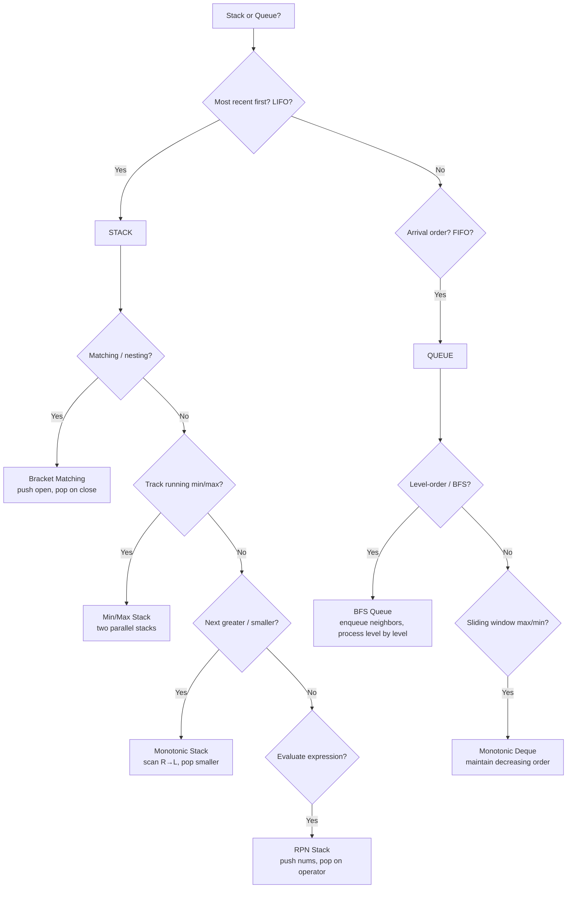

# Stacks & Queues — Quick Reference

## Stack vs Queue

| | Stack (LIFO) | Queue (FIFO) |
|---|---|---|
| Analogy | Stack of plates | Checkout line |
| Add | `push` to top | `enqueue` to back |
| Remove | `pop` from top | `dequeue` from front |
| Peek | Top element | Front element |
| Python | `list` (append/pop) | `deque` (append/popleft) |
| All ops | O(1) | O(1) |

### Python Implementations

```python
# Stack — use a list
stack = []
stack.append(x)      # push
stack.pop()           # pop
stack[-1]             # peek
len(stack) == 0       # is_empty

# Queue — use deque (NOT list.pop(0) which is O(n))
from collections import deque
queue = deque()
queue.append(x)      # enqueue
queue.popleft()      # dequeue
queue[0]             # peek
len(queue) == 0      # is_empty
```

---

## Pattern Decision Flowchart



---

## Pattern 1: Bracket Matching

**When**: Validate parentheses, match open/close pairs, nested structures

**Intuition**: The most recently opened bracket must close first — that's LIFO.

```python
def is_valid(s):
    matching = {')': '(', '}': '{', ']': '['}
    stack = []
    for ch in s:
        if ch in matching.values():
            stack.append(ch)
        elif ch in matching:
            if not stack or stack[-1] != matching[ch]:
                return False
            stack.pop()
    return len(stack) == 0
```

| Time | Space |
|---|---|
| O(n) | O(n) |
| LC 20 | |

---

## Pattern 2: Min/Max Stack

**When**: O(1) push, pop, AND getMin/getMax

**Intuition**: A parallel stack records the current min at each depth level. When you pop, both stacks pop — the min "reverts" automatically.

```python
class MinStack:
    def __init__(self):
        self.stack = []
        self.min_stack = []

    def push(self, val):
        self.stack.append(val)
        curr_min = min(val, self.min_stack[-1]) if self.min_stack else val
        self.min_stack.append(curr_min)

    def pop(self):
        self.stack.pop()
        self.min_stack.pop()

    def top(self):
        return self.stack[-1]

    def getMin(self):
        return self.min_stack[-1]
```

| Time | Space |
|---|---|
| O(1) all ops | O(n) |
| LC 155 | |

---

## Pattern 3: Monotonic Stack

**When**: Next greater/smaller element, daily temperatures, stock span

**Intuition**: Maintain a stack in sorted order. When a new element violates the order, pop — those popped elements just found their "next greater/smaller."

### Next Greater Element (scan R → L)

```python
def next_greater(nums):
    n = len(nums)
    result = [-1] * n
    stack = []
    for i in range(n - 1, -1, -1):
        while stack and stack[-1] <= nums[i]:
            stack.pop()
        if stack:
            result[i] = stack[-1]
        stack.append(nums[i])
    return result
```

### Daily Temperatures (scan L → R, store indices)

```python
def daily_temperatures(temps):
    n = len(temps)
    answer = [0] * n
    stack = []  # indices
    for i in range(n):
        while stack and temps[i] > temps[stack[-1]]:
            j = stack.pop()
            answer[j] = i - j
        stack.append(i)
    return answer
```

**Why O(n)?** Each element is pushed once and popped at most once → 2n total operations.

| Time | Space |
|---|---|
| O(n) | O(n) |
| LC 496, 503, 739, 84 | |

---

## Pattern 4: Expression Evaluation (RPN)

**When**: Evaluate postfix expressions, convert infix to postfix

**Intuition**: Numbers are operands — push them. Operators consume the top two — pop, compute, push result.

```python
def eval_rpn(tokens):
    stack = []
    ops = {
        '+': lambda a, b: a + b,
        '-': lambda a, b: a - b,
        '*': lambda a, b: a * b,
        '/': lambda a, b: int(a / b),
    }
    for token in tokens:
        if token in ops:
            b, a = stack.pop(), stack.pop()
            stack.append(ops[token](a, b))
        else:
            stack.append(int(token))
    return stack[0]
```

> First pop = right operand, second pop = left operand (matters for `-` and `/`).

| Time | Space |
|---|---|
| O(n) | O(n) |
| LC 150 | |

---

## Pattern 5: BFS Queue

**When**: Level-order traversal, shortest path in unweighted graph

**Intuition**: Process nodes in the order they were discovered. Enqueue neighbors, dequeue the next node to visit.

```python
from collections import deque

def bfs(start):
    queue = deque([start])
    visited = {start}
    while queue:
        node = queue.popleft()
        for neighbor in get_neighbors(node):
            if neighbor not in visited:
                visited.add(neighbor)
                queue.append(neighbor)
```

| Time | Space |
|---|---|
| O(V + E) | O(V) |

---

## Pattern 6: Monotonic Deque (Sliding Window Max/Min)

**When**: Max or min in a sliding window of size k

**Intuition**: Maintain a deque in decreasing order. Front = current window max. Pop from back when new element is bigger (they'll never be the max). Pop from front when index falls outside the window.

```python
from collections import deque

def max_sliding_window(nums, k):
    dq = deque()  # stores indices, values in decreasing order
    result = []
    for i in range(len(nums)):
        while dq and nums[dq[-1]] <= nums[i]:
            dq.pop()
        dq.append(i)
        if dq[0] < i - k + 1:
            dq.popleft()
        if i >= k - 1:
            result.append(nums[dq[0]])
    return result
```

| Time | Space |
|---|---|
| O(n) | O(k) |
| LC 239 | |

---

## Pattern 7: Queue via Two Stacks

**When**: Interview question — implement FIFO with only LIFO

```python
class MyQueue:
    def __init__(self):
        self.in_stack = []
        self.out_stack = []

    def enqueue(self, x):
        self.in_stack.append(x)

    def dequeue(self):
        if not self.out_stack:
            while self.in_stack:
                self.out_stack.append(self.in_stack.pop())
        return self.out_stack.pop()
```

**Intuition**: Pouring one stack into another reverses the order — LIFO becomes FIFO. Each element moves at most twice → amortized O(1).

| Time | Space |
|---|---|
| O(1) amortized | O(n) |
| LC 232 | |

---

## Largest Rectangle in Histogram

**When**: Find max rectangular area under bars (classic hard monotonic stack)

```python
def largest_rectangle(heights):
    stack = []
    max_area = 0
    n = len(heights)
    for i in range(n):
        while stack and heights[stack[-1]] > heights[i]:
            h = heights[stack.pop()]
            w = i - stack[-1] - 1 if stack else i
            max_area = max(max_area, h * w)
        stack.append(i)
    while stack:
        h = heights[stack.pop()]
        w = n - stack[-1] - 1 if stack else n
        max_area = max(max_area, h * w)
    return max_area
```

| Time | Space | LC |
|---|---|---|
| O(n) | O(n) | 84 |

---

## Complexity Summary

| Pattern | Time | Space |
|---|---|---|
| Bracket matching | O(n) | O(n) |
| Min/Max stack | O(1) per op | O(n) |
| Monotonic stack | O(n) | O(n) |
| RPN evaluation | O(n) | O(n) |
| BFS queue | O(V + E) | O(V) |
| Sliding window max (deque) | O(n) | O(k) |
| Queue via two stacks | O(1) amortized | O(n) |
| Largest rectangle | O(n) | O(n) |

---

## When to Use What

| Signal in Problem | Data Structure |
|---|---|
| "Valid parentheses", "matching pairs" | Stack |
| "Next greater / warmer / taller" | Monotonic stack |
| "Min element at any time" | Min stack (two stacks) |
| "Evaluate expression" | Stack |
| "Level-order", "shortest path" | Queue (BFS) |
| "Sliding window max/min" | Monotonic deque |
| "Undo / backtrack" | Stack |
| "Process in arrival order" | Queue |

---

## Common Mistakes

| Mistake | Why it breaks | Fix |
|---|---|---|
| Using `list.pop(0)` for queue | O(n) per dequeue | Use `deque.popleft()` |
| Popping from empty stack | `IndexError` | Check `len(stack) > 0` before pop |
| Wrong operand order in RPN | `6 / 2` becomes `2 / 6` | First pop = right, second pop = left |
| Not draining the stack at the end | Misses elements with no "next greater" | Process remaining elements after main loop |
| Forgetting deque front cleanup | Stale indices outside window | Check `dq[0] < i - k + 1` |
| Storing values instead of indices | Can't compute distances / positions | Store indices, access values via `nums[idx]` |
| Confusing stack top direction | Monotonic increasing vs decreasing | Draw it out: bottom → top order |
