# Hash Maps & Sets — Quick Reference

---

## Core Operations & Big-O

| Operation | `dict` | `set` | `list` (comparison) |
|-----------|--------|-------|---------------------|
| Lookup (`x in`) | O(1) avg | O(1) avg | O(n) |
| Insert / Add | O(1) avg | O(1) avg | O(1) append / O(n) insert |
| Delete | O(1) avg | O(1) avg | O(n) |
| Iterate all | O(n) | O(n) | O(n) |
| Get / Set by key | O(1) avg | — | O(1) by index |

> **Worst-case** for dict/set ops is O(n) due to hash collisions — almost never happens in practice.

---

## Decision Flowchart

```mermaid
flowchart TD
    A[Need O&#40;1&#41; lookup?] -->|Yes| B{What are you storing?}
    A -->|No| Z[Consider list / sorting]
    B -->|Key-Value pairs| C[Use dict]
    B -->|Just membership| D[Use set]
    C --> E{Need counts?}
    E -->|Yes| F[Counter]
    E -->|No| G{Need grouping?}
    G -->|Yes| H[defaultdict&#40;list&#41;]
    G -->|No| I{Need default values?}
    I -->|Yes| J[defaultdict&#40;int/list&#41;]
    I -->|No| K[Regular dict]
    D --> L{Set operations needed?}
    L -->|Union/Intersect/Diff| M[set &#124; & - operators]
    L -->|Just contains check| N[set&#40;&#41; + in]
```



---

## Pattern Templates

### 1. Complement Lookup (Two Sum)

> *Find two elements that satisfy a relationship — store what you've seen.*

```python
def two_sum(nums, target):
    seen = {}  # val -> index
    for i, num in enumerate(nums):
        comp = target - num
        if comp in seen:
            return [seen[comp], i]
        seen[num] = i
```

### 2. Frequency Counting

> *Count occurrences — use `Counter` or `defaultdict(int)`.*

```python
from collections import Counter

freq = Counter(nums)           # {element: count}
most_common = freq.most_common(k)  # top k elements

# Manual version
freq = {}
for x in nums:
    freq[x] = freq.get(x, 0) + 1
```

### 3. Grouping / Bucketing

> *Group elements by a shared property — use `defaultdict(list)`.*

```python
from collections import defaultdict

groups = defaultdict(list)
for item in items:
    key = compute_key(item)  # e.g., sorted(word), len(word)
    groups[key].append(item)
```

### 4. Duplicate Detection

> *Check if any element appears more than once — set size vs list size.*

```python
def has_duplicates(nums):
    return len(nums) != len(set(nums))

# Or early exit version
seen = set()
for num in nums:
    if num in seen:
        return True
    seen.add(num)
return False
```

### 5. Longest Consecutive Sequence

> *Find streak length — only start counting from sequence beginnings.*

```python
def longest_consecutive(nums):
    num_set = set(nums)
    best = 0
    for n in num_set:
        if n - 1 not in num_set:  # start of a sequence
            length = 0
            while n + length in num_set:
                length += 1
            best = max(best, length)
    return best
```

### 6. Prefix Sum + Hash Map

> *Subarray sum equals k — store prefix sums seen so far.*

```python
def subarray_sum(nums, k):
    prefix = {0: 1}  # prefix_sum -> count
    curr_sum, count = 0, 0
    for num in nums:
        curr_sum += num
        count += prefix.get(curr_sum - k, 0)
        prefix[curr_sum] = prefix.get(curr_sum, 0) + 1
    return count
```

### 7. Anagram Detection

> *Two strings are anagrams if their character counts match.*

```python
def is_anagram(s, t):
    return Counter(s) == Counter(t)

# Group anagrams
def group_anagrams(strs):
    groups = defaultdict(list)
    for s in strs:
        groups[tuple(sorted(s))].append(s)
    return list(groups.values())
```

### 8. Sliding Window + Hash Map (Membership)

> *Track element counts in a sliding window.*

```python
def longest_substring_k_distinct(s, k):
    window = {}
    left = best = 0
    for right, ch in enumerate(s):
        window[ch] = window.get(ch, 0) + 1
        while len(window) > k:
            window[s[left]] -= 1
            if window[s[left]] == 0:
                del window[s[left]]
            left += 1
        best = max(best, right - left + 1)
    return best
```

---

## Key Intuitions

- **"Need to find something fast?"** → Hash map gives O(1) lookup
- **"Counting things?"** → `Counter` is your friend
- **"Grouping by property?"** → `defaultdict(list)` with a key function
- **"Subarray sum = k?"** → Prefix sum + hash map (stores `{prefix_sum: count}`)
- **"Complement / pair problems?"** → Store what you've seen, check for complement
- **"Remove duplicates / membership?"** → `set()`

---

## Common Mistakes

| Mistake | Fix |
|---------|-----|
| Using a mutable type (list) as dict key | Use `tuple(sorted(lst))` instead |
| `d[key] += 1` on missing key → `KeyError` | Use `d.get(key, 0) + 1` or `defaultdict(int)` |
| Forgetting `del window[ch]` when count hits 0 | Always clean up zero-count entries in sliding window |
| Modifying dict while iterating | Iterate over `list(d.keys())` or build a new dict |
| Using `dict.setdefault()` when `defaultdict` is cleaner | Prefer `defaultdict` for readability |
| Not initializing prefix sum map with `{0: 1}` | The empty prefix (sum = 0) is a valid starting point |
