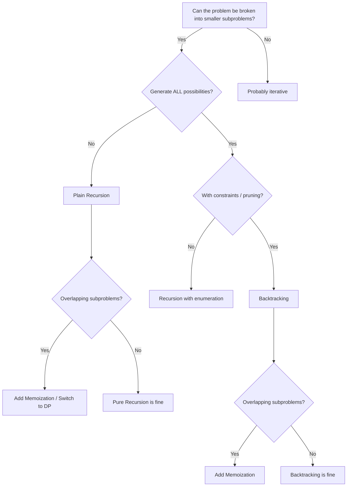

# Recursion & Backtracking — Quick Reference

---

## The 3 Questions for Any Recursive Problem

| # | Question | Example (factorial) |
|---|----------|---------------------|
| 1 | **Base case** — When do I stop? | `n == 0 → return 1` |
| 2 | **Recursive step** — How do I make the problem smaller? | `n * factorial(n-1)` |
| 3 | **Combine** — How do I use the sub-result? | Multiply `n` by the result of the smaller call |

---

## Decision Flowchart



---

## Core Templates

### Plain Recursion

```python
def solve(problem):
    # 1. Base case
    if is_base_case(problem):
        return base_result

    # 2. Recursive step
    smaller = make_smaller(problem)
    sub_result = solve(smaller)

    # 3. Combine
    return combine(sub_result)
```

### Backtracking

```python
def backtrack(candidates, path, result):
    # Base case — found a valid solution
    if is_goal(path):
        result.append(path[:])  # copy!
        return

    for choice in candidates:
        if not is_valid(choice):
            continue

        path.append(choice)         # make choice
        backtrack(next_candidates, path, result)  # explore
        path.pop()                  # undo choice

    return result
```

### Recursion + Memoization

```python
from functools import lru_cache

@lru_cache(maxsize=None)
def solve(state):
    if is_base_case(state):
        return base_result
    # state must be hashable (use tuples, not lists)
    return combine(solve(smaller_state))
```

---

## Pattern Templates

### 1. Subsets (Include / Skip)

> *At each element, choose to include it or skip it → 2^n subsets.*

```python
def subsets(nums):
    result = []
    def backtrack(i, path):
        if i == len(nums):
            result.append(path[:])
            return
        # Skip nums[i]
        backtrack(i + 1, path)
        # Include nums[i]
        path.append(nums[i])
        backtrack(i + 1, path)
        path.pop()
    backtrack(0, [])
    return result
```

### 2. Permutations (Choose from Remaining)

> *At each position, pick any unused element.*

```python
def permutations(nums):
    result = []
    def backtrack(path, used):
        if len(path) == len(nums):
            result.append(path[:])
            return
        for i in range(len(nums)):
            if used[i]:
                continue
            used[i] = True
            path.append(nums[i])
            backtrack(path, used)
            path.pop()
            used[i] = False
    backtrack([], [False] * len(nums))
    return result
```

### 3. Combination Sum (Reuse Allowed)

> *Pick candidates that sum to target — can reuse elements.*

```python
def combination_sum(candidates, target):
    result = []
    def backtrack(start, path, remaining):
        if remaining == 0:
            result.append(path[:])
            return
        for i in range(start, len(candidates)):
            if candidates[i] > remaining:
                break  # prune (requires sorted candidates)
            path.append(candidates[i])
            backtrack(i, path, remaining - candidates[i])  # i, not i+1 → reuse
            path.pop()
    candidates.sort()
    backtrack(0, [], target)
    return result
```

### 4. Constraint-Based (N-Queens)

> *Place items under constraints — validate before placing.*

```python
def n_queens(n):
    result = []
    cols, diag, anti = set(), set(), set()

    def backtrack(row, board):
        if row == n:
            result.append(["".join(r) for r in board])
            return
        for col in range(n):
            if col in cols or (row - col) in diag or (row + col) in anti:
                continue
            cols.add(col); diag.add(row - col); anti.add(row + col)
            board[row][col] = "Q"
            backtrack(row + 1, board)
            board[row][col] = "."
            cols.remove(col); diag.remove(row - col); anti.remove(row + col)

    backtrack(0, [["." for _ in range(n)] for _ in range(n)])
    return result
```

### 5. Grid Exploration (Word Search)

> *DFS on a 2D grid — mark visited, explore 4 directions, unmark.*

```python
def word_search(board, word):
    rows, cols = len(board), len(board[0])

    def backtrack(r, c, idx):
        if idx == len(word):
            return True
        if r < 0 or r >= rows or c < 0 or c >= cols:
            return False
        if board[r][c] != word[idx]:
            return False

        temp = board[r][c]
        board[r][c] = "#"  # mark visited
        for dr, dc in [(0,1),(0,-1),(1,0),(-1,0)]:
            if backtrack(r + dr, c + dc, idx + 1):
                return True
        board[r][c] = temp  # unmark
        return False

    for r in range(rows):
        for c in range(cols):
            if backtrack(r, c, 0):
                return True
    return False
```

---

## Time Complexity Reference

| Pattern | Time | Space (call stack) |
|---------|------|--------------------|
| Subsets | O(2^n) | O(n) |
| Permutations | O(n!) | O(n) |
| Combinations (no reuse) | O(2^n) | O(n) |
| Combination Sum (reuse) | O(2^t) where t = target/min_val | O(t) |
| N-Queens | O(n!) | O(n) |
| Grid DFS (word search) | O(m·n·4^L) where L = word length | O(L) |

---

## When to Add Memoization

- You see the **same subproblem solved multiple times** (e.g., Fibonacci tree)
- State can be captured in a **hashable key** (tuple of args)
- The recursion is **not** building/collecting all solutions (memo stores one value per state, not lists of paths)
- Rule of thumb: if you draw the recursion tree and see **repeated nodes** → memoize

---

## Key Intuitions

- **Backtracking = DFS on a decision tree** — each node is a choice point
- **"Generate all X"** → backtracking with `result.append(path[:])`
- **"Find one valid X"** → backtracking with early `return True`
- **Include/Skip** is the most fundamental pattern — subsets, knapsack, partitions all use it
- **Pruning** = skipping branches early when you know they can't lead to a solution
- **`path[:]` not `path`** — always copy before appending to result

---

## Common Mistakes

| Mistake | Fix |
|---------|-----|
| Missing base case → infinite recursion | Always define when to stop first |
| Not undoing choice (`path.pop()`) | Every `append` needs a matching `pop` after the recursive call |
| Appending `path` instead of `path[:]` | Lists are mutable — you must copy before storing |
| Modifying shared state (set/list) without restoring | `add` ↔ `remove`, `append` ↔ `pop` |
| Using `@lru_cache` with list args | Convert to tuple: `lru_cache` needs hashable args |
| Forgetting `start` index → duplicate combinations | Pass `start` param and loop from `start`, not `0` |
| Stack overflow on deep recursion | `sys.setrecursionlimit()` or convert to iterative |
