# Sorting Algorithms — Quick Reference

---

## Comparison Table

| Algorithm | Best | Average | Worst | Space | Stable? | In-Place? |
|-----------|------|---------|-------|-------|---------|-----------|
| **Bubble Sort** | O(n) | O(n²) | O(n²) | O(1) | Yes | Yes |
| **Selection Sort** | O(n²) | O(n²) | O(n²) | O(1) | No | Yes |
| **Insertion Sort** | O(n) | O(n²) | O(n²) | O(1) | Yes | Yes |
| **Merge Sort** | O(n log n) | O(n log n) | O(n log n) | O(n) | Yes | No |
| **Quick Sort** | O(n log n) | O(n log n) | O(n²) | O(log n) | No | Yes |
| **Heap Sort** | O(n log n) | O(n log n) | O(n log n) | O(1) | No | Yes |
| **Counting Sort** | O(n + k) | O(n + k) | O(n + k) | O(k) | Yes | No |
| **Radix Sort** | O(d·n) | O(d·n) | O(d·n) | O(n + k) | Yes | No |
| **Tim Sort** (Python) | O(n) | O(n log n) | O(n log n) | O(n) | Yes | No |

> **k** = range of values, **d** = number of digits

---

## Decision Flowchart

```mermaid
flowchart TD
    A[Need to sort?] --> B{Data size?}
    B -->|Small n ≤ ~50| C[Insertion Sort]
    B -->|Large n| D{Constraints?}
    D -->|Need stable sort| E[Merge Sort]
    D -->|Need in-place| F[Quick Sort]
    D -->|Guaranteed O&#40;n log n&#41;| G{Space OK?}
    G -->|O&#40;n&#41; OK| E
    G -->|O&#40;1&#41; needed| H[Heap Sort]
    D -->|Integers in known range| I[Counting Sort]
    D -->|Nearly sorted data| C
    D -->|Just use Python| J[sorted&#40;&#41; / .sort&#40;&#41; — Tim Sort]
```



---

## Stability — Why It Matters

**Stable** = elements with equal keys keep their original relative order.

```
Input:  [(Alice, 90), (Bob, 90), (Carol, 85)]
Stable sort by score:   [(Carol, 85), (Alice, 90), (Bob, 90)]  ← Alice before Bob preserved
Unstable sort by score: [(Carol, 85), (Bob, 90), (Alice, 90)]  ← order may flip
```

> Matters when sorting by multiple keys — sort by secondary key first, then primary.

---

## When to Use Which

| Situation | Best Choice | Why |
|-----------|-------------|-----|
| Small array (n ≤ ~50) | Insertion Sort | Low overhead, fast on small data |
| Nearly sorted data | Insertion Sort | O(n) best case |
| Need guaranteed O(n log n) | Merge Sort | No worst-case degradation |
| Need stable sort | Merge Sort | Preserves relative order |
| Fast average, in-place | Quick Sort | Cache-friendly, low overhead |
| Integers in small range | Counting Sort | O(n + k) beats comparison sorts |
| Python built-in needed | `sorted()` / `.sort()` | Tim Sort: hybrid, optimized, stable |

---

## Algorithm Implementations

### Merge Sort

```python
def merge_sort(arr):
    if len(arr) <= 1:
        return arr

    mid = len(arr) // 2
    left = merge_sort(arr[:mid])
    right = merge_sort(arr[mid:])
    return merge(left, right)

def merge(left, right):
    result = []
    i = j = 0
    while i < len(left) and j < len(right):
        if left[i] <= right[j]:  # <= makes it stable
            result.append(left[i])
            i += 1
        else:
            result.append(right[j])
            j += 1
    result.extend(left[i:])
    result.extend(right[j:])
    return result
```

### Quick Sort

```python
def quick_sort(arr):
    if len(arr) <= 1:
        return arr

    pivot = arr[len(arr) // 2]
    left = [x for x in arr if x < pivot]
    mid = [x for x in arr if x == pivot]
    right = [x for x in arr if x > pivot]
    return quick_sort(left) + mid + quick_sort(right)
```

### Quick Sort (In-Place, Lomuto Partition)

```python
def quick_sort_inplace(arr, lo=0, hi=None):
    if hi is None:
        hi = len(arr) - 1
    if lo < hi:
        p = partition(arr, lo, hi)
        quick_sort_inplace(arr, lo, p - 1)
        quick_sort_inplace(arr, p + 1, hi)

def partition(arr, lo, hi):
    pivot = arr[hi]
    i = lo
    for j in range(lo, hi):
        if arr[j] < pivot:
            arr[i], arr[j] = arr[j], arr[i]
            i += 1
    arr[i], arr[hi] = arr[hi], arr[i]
    return i
```

### Counting Sort

```python
def counting_sort(arr):
    if not arr:
        return arr
    lo, hi = min(arr), max(arr)
    count = [0] * (hi - lo + 1)
    for x in arr:
        count[x - lo] += 1
    result = []
    for i, c in enumerate(count):
        result.extend([i + lo] * c)
    return result
```

---

## Python Sorting Tips

```python
# sorted() returns new list — original unchanged
sorted_list = sorted(nums)
sorted_desc = sorted(nums, reverse=True)

# .sort() sorts in-place — returns None
nums.sort()
nums.sort(reverse=True)

# Custom key function
words.sort(key=len)                        # by length
words.sort(key=str.lower)                  # case-insensitive
pairs.sort(key=lambda x: x[1])            # by second element

# Multiple keys — tuple comparison
students.sort(key=lambda s: (s.grade, s.name))  # grade first, then name

# Reverse only one key — negate numeric keys
students.sort(key=lambda s: (-s.score, s.name))  # highest score, then alphabetical name
```

---

## Key Intuitions

- **Comparison sorts can't beat O(n log n)** — proven lower bound
- **Merge Sort** = divide array, sort halves, merge — always O(n log n) but uses O(n) space
- **Quick Sort** = pick pivot, partition around it — O(n²) worst case but fast in practice
- **Insertion Sort** = shift elements right to make room — great for small/nearly-sorted data
- **Counting Sort** = count occurrences, reconstruct — beats O(n log n) when range is small
- **Python's Tim Sort** = merge sort + insertion sort hybrid — already optimized for real data

---

## Common Mistakes

| Mistake | Fix |
|---------|-----|
| Using `<` instead of `<=` in merge → unstable | Use `<=` to preserve relative order of equal elements |
| Quick sort always picking first/last as pivot | Use median-of-three or random pivot to avoid O(n²) |
| Forgetting `.sort()` returns `None` | `sorted()` returns a new list; `.sort()` mutates in-place |
| Sorting when you only need k-th element | Use `heapq.nlargest(k, arr)` or quickselect O(n) |
| Implementing sort from scratch in interviews (Python) | Usually `sorted()` is fine — only hand-code when asked |
| Off-by-one in merge sort `mid` calculation | `mid = len(arr) // 2`, left = `[:mid]`, right = `[mid:]` |
