# Binary Search — Quick Reference

---

## The 3 Templates

### Template 1: `lo <= hi` (Standard — Exact Match)

Use when searching for an **exact target** in a sorted array.

```python
def binary_search(nums, target):
    lo, hi = 0, len(nums) - 1
    while lo <= hi:
        mid = lo + (hi - lo) // 2
        if nums[mid] == target:
            return mid
        elif nums[mid] < target:
            lo = mid + 1
        else:
            hi = mid - 1
    return -1  # not found
```

> **Loop ends when:** `lo > hi` (search space empty)

### Template 2: `lo < hi` (Boundary — Find First/Last)

Use when searching for a **boundary condition** (first occurrence, insertion point).

```python
def first_occurrence(nums, target):
    lo, hi = 0, len(nums) - 1
    while lo < hi:
        mid = lo + (hi - lo) // 2
        if nums[mid] < target:
            lo = mid + 1
        else:
            hi = mid  # don't skip mid — it might be the answer
    return lo if nums[lo] == target else -1
```

> **Loop ends when:** `lo == hi` (one candidate left)

### Template 3: `lo < hi - 1` (Neighbor — Need Adjacent Comparison)

Use when you need to **compare with neighbors** (peak finding, avoid infinite loop edge cases).

```python
def find_peak(nums):
    lo, hi = 0, len(nums) - 1
    while lo < hi - 1:
        mid = lo + (hi - lo) // 2
        if nums[mid] > nums[mid + 1]:
            hi = mid
        else:
            lo = mid
    return lo if nums[lo] >= nums[hi] else hi
```

> **Loop ends when:** `lo + 1 == hi` (two candidates left — check both)

---

## Decision Flowchart

```mermaid
flowchart TD
    A[Sorted or monotonic property?] -->|Yes| B{What to find?}
    A -->|No| Z[Binary search won't work]
    B -->|Exact value| C[Template 1: lo ≤ hi]
    B -->|First/Last occurrence| D[Template 2: lo < hi]
    B -->|Minimize / Maximize a value| E[Search on Answer]
    B -->|Peak / Valley| F[Template 3: lo < hi-1]
    B -->|Rotated sorted array| G{What about it?}
    G -->|Find target| H[Check which half is sorted]
    G -->|Find minimum| I[Template 2: compare with hi]
    E --> J[Define feasible&#40;&#41;, binary search the answer space]
```



---

## Pattern Templates

### 1. Exact Search

> *Find target in sorted array. Classic binary search.*

```python
# Use Template 1 above — returns index or -1
```

### 2. First / Last Occurrence

> *Find leftmost or rightmost position of target.*

```python
def first_position(nums, target):
    lo, hi = 0, len(nums) - 1
    result = -1
    while lo <= hi:
        mid = lo + (hi - lo) // 2
        if nums[mid] == target:
            result = mid
            hi = mid - 1     # keep searching left
        elif nums[mid] < target:
            lo = mid + 1
        else:
            hi = mid - 1
    return result

def last_position(nums, target):
    lo, hi = 0, len(nums) - 1
    result = -1
    while lo <= hi:
        mid = lo + (hi - lo) // 2
        if nums[mid] == target:
            result = mid
            lo = mid + 1     # keep searching right
        elif nums[mid] < target:
            lo = mid + 1
        else:
            hi = mid - 1
    return result
```

### 3. Search in Rotated Sorted Array

> *Key insight: one half is always sorted — check if target is in the sorted half.*

```python
def search_rotated(nums, target):
    lo, hi = 0, len(nums) - 1
    while lo <= hi:
        mid = lo + (hi - lo) // 2
        if nums[mid] == target:
            return mid
        if nums[lo] <= nums[mid]:        # left half sorted
            if nums[lo] <= target < nums[mid]:
                hi = mid - 1
            else:
                lo = mid + 1
        else:                            # right half sorted
            if nums[mid] < target <= nums[hi]:
                lo = mid + 1
            else:
                hi = mid - 1
    return -1
```

### 4. Find Minimum in Rotated Array

> *Compare mid with hi — if mid > hi, min is in right half.*

```python
def find_min_rotated(nums):
    lo, hi = 0, len(nums) - 1
    while lo < hi:
        mid = lo + (hi - lo) // 2
        if nums[mid] > nums[hi]:
            lo = mid + 1
        else:
            hi = mid
    return nums[lo]
```

### 5. Peak Element

> *Compare mid with mid+1 — climb toward the peak.*

```python
def find_peak(nums):
    lo, hi = 0, len(nums) - 1
    while lo < hi:
        mid = lo + (hi - lo) // 2
        if nums[mid] < nums[mid + 1]:
            lo = mid + 1     # peak is to the right
        else:
            hi = mid         # peak is at mid or to the left
    return lo
```

### 6. Binary Search on Answer

> *The answer itself is monotonic — binary search the answer space.*

**Template:**

```python
def search_on_answer(lo, hi):
    while lo < hi:
        mid = lo + (hi - lo) // 2
        if feasible(mid):
            hi = mid         # try smaller (minimize)
        else:
            lo = mid + 1
    return lo

def feasible(value):
    # return True if 'value' satisfies the constraint
    pass
```

**Example — Koko Eating Bananas (minimize eating speed):**

```python
def min_eating_speed(piles, h):
    lo, hi = 1, max(piles)
    while lo < hi:
        mid = lo + (hi - lo) // 2
        hours = sum((p + mid - 1) // mid for p in piles)  # ceil division
        if hours <= h:
            hi = mid         # can eat slower
        else:
            lo = mid + 1     # need to eat faster
    return lo
```

**Example — Split Array Largest Sum (minimize the maximum sum):**

```python
def split_array(nums, k):
    lo, hi = max(nums), sum(nums)
    while lo < hi:
        mid = lo + (hi - lo) // 2
        if can_split(nums, k, mid):
            hi = mid
        else:
            lo = mid + 1
    return lo

def can_split(nums, k, max_sum):
    count, curr = 1, 0
    for n in nums:
        if curr + n > max_sum:
            count += 1
            curr = n
        else:
            curr += n
    return count <= k
```

---

## Python `bisect` Module

```python
import bisect

# bisect_left  → first position where target can be inserted (= first occurrence)
# bisect_right → position after last occurrence
i = bisect.bisect_left(sorted_list, target)
j = bisect.bisect_right(sorted_list, target)

# Number of occurrences of target
count = bisect.bisect_right(arr, target) - bisect.bisect_left(arr, target)

# Insert while maintaining sort order
bisect.insort(sorted_list, value)
```

---

## Key Intuitions

- **Binary search works whenever there's a monotonic property** — not just sorted arrays
- **"Minimize the maximum" or "maximize the minimum"** → search on answer
- **Rotated array** → one half is always sorted; decide which half target could be in
- **`lo + (hi - lo) // 2`** prevents integer overflow (matters in other languages, good habit)
- **Search on answer** = define `feasible()`, then binary search the answer space
- **Template 2 (`lo < hi`)** is safest for boundary problems — loop exits with exactly one candidate

---

## Complexity

| Pattern | Time | Space |
|---------|------|-------|
| Standard binary search | O(log n) | O(1) |
| First / last occurrence | O(log n) | O(1) |
| Rotated array search | O(log n) | O(1) |
| Peak element | O(log n) | O(1) |
| Search on answer | O(n · log(range)) | O(1) |

> Search on answer: O(log(range)) iterations × O(n) per `feasible()` check

---

## Common Mistakes

| Mistake | Fix |
|---------|-----|
| `mid = (lo + hi) / 2` → float in Python 3 | Use `mid = lo + (hi - lo) // 2` |
| `lo = mid` without `+ 1` → infinite loop | When `lo < hi` and `lo = mid`, ensure `mid` rounds up: `lo + (hi - lo + 1) // 2` |
| Wrong comparison in rotated array | Use `nums[lo] <= nums[mid]` (not `<`) to handle two-element case |
| Off-by-one: `hi = len(nums)` vs `len(nums) - 1` | Match to your template — `<= hi` needs `hi = len - 1`; `< hi` can use `hi = len` |
| Not handling empty array | Add `if not nums: return -1` guard |
| Search on answer: wrong `lo`/`hi` bounds | `lo` = minimum possible answer, `hi` = maximum possible answer |
| Forgetting `feasible()` needs to be monotonic | If `feasible(x)` is True, all values beyond x (in search direction) must also be True |
