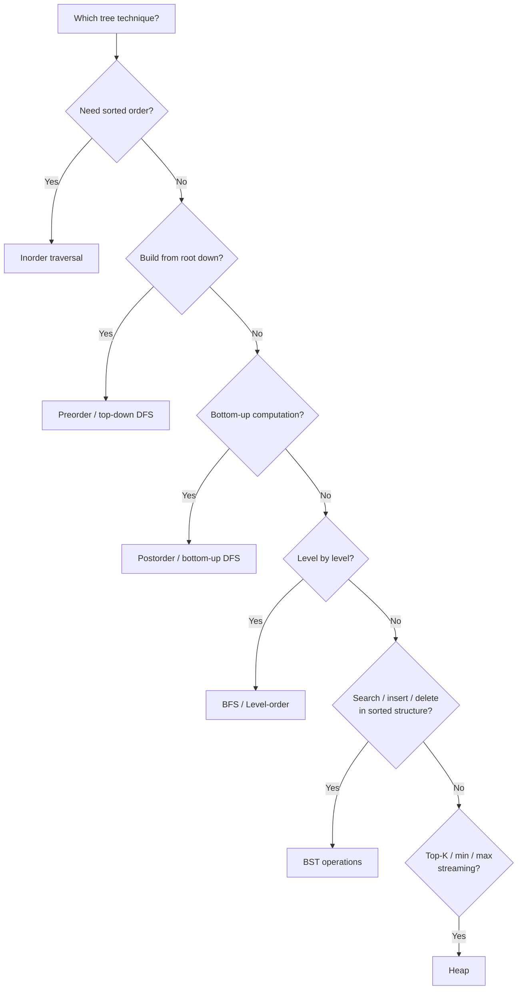

# 🌳 Trees — Quick Reference

---

## TreeNode Definition

```python
class TreeNode:
    def __init__(self, val=0, left=None, right=None):
        self.val = val
        self.left = left
        self.right = right
```

---

## 4 Traversals — Recursive (1-liners)

```python
def inorder(node):    return inorder(node.left) + [node.val] + inorder(node.right) if node else []
def preorder(node):   return [node.val] + preorder(node.left) + preorder(node.right) if node else []
def postorder(node):  return postorder(node.left) + postorder(node.right) + [node.val] if node else []
def levelorder(root): # see BFS template below
```

| Traversal | Order | Use Case |
|-----------|-------|----------|
| **Inorder** | Left → Root → Right | BST → sorted output |
| **Preorder** | Root → Left → Right | Serialize / copy tree |
| **Postorder** | Left → Right → Root | Delete tree / bottom-up calc |
| **Level-order** | Level by level | BFS, shortest depth |

---

## Iterative Traversal Templates

### Inorder (Stack)
```python
def inorder_iter(root):
    stack, res = [], []
    curr = root
    while curr or stack:
        while curr:
            stack.append(curr)
            curr = curr.left
        curr = stack.pop()
        res.append(curr.val)
        curr = curr.right
    return res
```

### Preorder (Stack)
```python
def preorder_iter(root):
    if not root: return []
    stack, res = [root], []
    while stack:
        node = stack.pop()
        res.append(node.val)
        if node.right: stack.append(node.right)  # right first → left processed first
        if node.left:  stack.append(node.left)
    return res
```

### Postorder (Stack — reverse trick)
```python
def postorder_iter(root):
    if not root: return []
    stack, res = [root], []
    while stack:
        node = stack.pop()
        res.append(node.val)
        if node.left:  stack.append(node.left)
        if node.right: stack.append(node.right)
    return res[::-1]  # reverse of modified preorder
```

### Level-Order (Queue)
```python
from collections import deque

def levelorder(root):
    if not root: return []
    queue, res = deque([root]), []
    while queue:
        level = []
        for _ in range(len(queue)):
            node = queue.popleft()
            level.append(node.val)
            if node.left:  queue.append(node.left)
            if node.right: queue.append(node.right)
        res.append(level)
    return res
```

---

## BST Operations

| Operation | Time | Key Idea |
|-----------|------|----------|
| Search | O(h) | Go left if target < node, right if target > node |
| Insert | O(h) | Find null spot, attach new node |
| Delete | O(h) | 0 children: remove; 1 child: bypass; 2 children: replace with inorder successor |
| Validate | O(n) | Inorder must be strictly increasing, OR pass (low, high) bounds |

```python
def is_valid_bst(node, lo=float('-inf'), hi=float('inf')):
    if not node: return True
    if not (lo < node.val < hi): return False
    return is_valid_bst(node.left, lo, node.val) and is_valid_bst(node.right, node.val, hi)
```

---

## Heap Operations (via `heapq`)

```python
import heapq

heap = []
heapq.heappush(heap, val)        # O(log n)
smallest = heapq.heappop(heap)   # O(log n)
heapq.heapify(arr)               # O(n) — in-place
top_k = heapq.nlargest(k, arr)   # O(n log k)
```

| Operation | Time |
|-----------|------|
| push | O(log n) |
| pop | O(log n) |
| peek (heap[0]) | O(1) |
| heapify | O(n) |

> **Tip:** For max-heap, negate values: `heappush(heap, -val)`

---

## Common Patterns

### Height
```python
def height(node):
    if not node: return 0
    return 1 + max(height(node.left), height(node.right))
```

### Diameter (max path length between any two nodes)
```python
def diameter(root):
    ans = 0
    def height(node):
        nonlocal ans
        if not node: return 0
        L, R = height(node.left), height(node.right)
        ans = max(ans, L + R)
        return 1 + max(L, R)
    height(root)
    return ans
```

### Lowest Common Ancestor (LCA)
```python
def lca(root, p, q):
    if not root or root == p or root == q: return root
    L = lca(root.left, p, q)
    R = lca(root.right, p, q)
    if L and R: return root   # p and q on different sides
    return L or R
```

### Balanced Check (O(n) — early exit)
```python
def is_balanced(root):
    def check(node):
        if not node: return 0
        L = check(node.left)
        R = check(node.right)
        if L == -1 or R == -1 or abs(L - R) > 1: return -1
        return 1 + max(L, R)
    return check(root) != -1
```

---

## Pattern Decision Flowchart



---

## Common Mistakes

| Mistake | Fix |
|---------|-----|
| Forgetting `if not node` base case | Always handle `None` first |
| Confusing **height** vs **depth** | Height = bottom-up (leaves=0); Depth = top-down (root=0) |
| BST validation with only parent check | Must propagate `(lo, hi)` bounds through entire subtree |
| Modifying tree during traversal | Collect nodes first, then modify |
| Using `==` to compare nodes | Compare `node.val` or use `is` for identity |
| Forgetting right-before-left in preorder stack | Push right child first so left is popped first |

---

## Key Intuitions

- **Recursion on trees = trust the subtree answers**, combine at current node
- **DFS → stack (implicit or explicit)** / **BFS → queue**
- **BST inorder = sorted array** — exploit this for validation, kth-smallest, etc.
- **Height-based problems** → postorder (need children's answers first)
- **Path problems** → track running sum/path, backtrack when returning
- **Heap ≠ BST** — heap only guarantees min/max at root, not full sorted order
