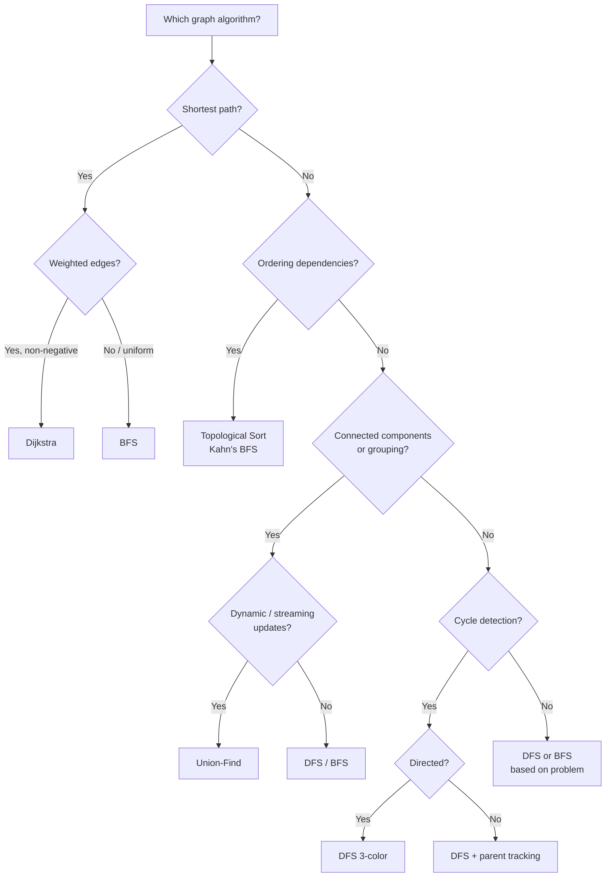

# 📊 Graphs — Quick Reference

---

## Representations

### Adjacency List (default choice)
```python
from collections import defaultdict

graph = defaultdict(list)
graph[u].append(v)       # directed
graph[u].append(v)       # undirected: add both
graph[v].append(u)
```

### Adjacency Matrix
```python
n = num_nodes
matrix = [[0] * n for _ in range(n)]
matrix[u][v] = 1         # or weight
```

| | Adj List | Adj Matrix |
|---|---------|-----------|
| Space | O(V + E) | O(V²) |
| Check edge (u,v) | O(degree) | O(1) |
| Iterate neighbors | O(degree) | O(V) |
| **Best for** | Sparse graphs | Dense graphs, quick edge lookup |

---

## BFS Template

```python
from collections import deque

def bfs(graph, start):
    visited = {start}
    queue = deque([start])
    while queue:
        node = queue.popleft()
        for neighbor in graph[node]:
            if neighbor not in visited:
                visited.add(neighbor)
                queue.append(neighbor)
```

> **Use BFS for:** shortest path (unweighted), level-order, minimum steps

---

## DFS Template

### Recursive
```python
def dfs(graph, node, visited):
    visited.add(node)
    for neighbor in graph[node]:
        if neighbor not in visited:
            dfs(graph, neighbor, visited)
```

### Iterative
```python
def dfs_iter(graph, start):
    visited = {start}
    stack = [start]
    while stack:
        node = stack.pop()
        for neighbor in graph[node]:
            if neighbor not in visited:
                visited.add(neighbor)
                stack.append(neighbor)
```

> **Use DFS for:** connected components, cycle detection, topological sort, path finding

---

## All Patterns at a Glance

| Pattern | Algorithm | Time | Key Idea |
|---------|-----------|------|----------|
| Connected components | DFS/BFS from each unvisited node | O(V+E) | Count DFS/BFS launches |
| Cycle (undirected) | DFS + parent tracking | O(V+E) | Visited neighbor ≠ parent → cycle |
| Cycle (directed) | DFS 3-color (white/gray/black) | O(V+E) | Gray → gray edge = back edge = cycle |
| Topological sort | Kahn's BFS (indegree) | O(V+E) | Remove 0-indegree nodes iteratively |
| Shortest path (unweighted) | BFS | O(V+E) | First visit = shortest distance |
| Shortest path (weighted, non-neg) | Dijkstra | O((V+E) log V) | Greedy: always expand cheapest |
| Grouping / connectivity | Union-Find | O(α(n)) per op | Near O(1) with optimizations |

---

## Cycle Detection — Directed Graph (3-Color)

```python
WHITE, GRAY, BLACK = 0, 1, 2

def has_cycle(graph, n):
    color = [WHITE] * n
    
    def dfs(u):
        color[u] = GRAY
        for v in graph[u]:
            if color[v] == GRAY: return True    # back edge → cycle
            if color[v] == WHITE and dfs(v): return True
        color[u] = BLACK
        return False
    
    return any(color[i] == WHITE and dfs(i) for i in range(n))
```

---

## Topological Sort — Kahn's Algorithm (BFS)

```python
from collections import deque

def topo_sort(graph, n):
    indegree = [0] * n
    for u in range(n):
        for v in graph[u]:
            indegree[v] += 1
    
    queue = deque(i for i in range(n) if indegree[i] == 0)
    order = []
    
    while queue:
        u = queue.popleft()
        order.append(u)
        for v in graph[u]:
            indegree[v] -= 1
            if indegree[v] == 0:
                queue.append(v)
    
    return order if len(order) == n else []  # empty = cycle exists
```

---

## Dijkstra's Algorithm

```python
import heapq

def dijkstra(graph, start, n):
    dist = [float('inf')] * n
    dist[start] = 0
    heap = [(0, start)]           # (distance, node)
    
    while heap:
        d, u = heapq.heappop(heap)
        if d > dist[u]: continue  # stale entry
        for v, w in graph[u]:     # graph[u] = [(neighbor, weight), ...]
            if dist[u] + w < dist[v]:
                dist[v] = dist[u] + w
                heapq.heappush(heap, (dist[v], v))
    
    return dist
```

---

## Union-Find (Disjoint Set Union)

```python
class UnionFind:
    def __init__(self, n):
        self.parent = list(range(n))
        self.rank = [0] * n
    
    def find(self, x):
        if self.parent[x] != x:
            self.parent[x] = self.find(self.parent[x])  # path compression
        return self.parent[x]
    
    def union(self, x, y):
        px, py = self.find(x), self.find(y)
        if px == py: return False           # already connected
        if self.rank[px] < self.rank[py]:   # union by rank
            px, py = py, px
        self.parent[py] = px
        if self.rank[px] == self.rank[py]:
            self.rank[px] += 1
        return True
```

| Operation | Time (with both optimizations) |
|-----------|-------------------------------|
| find | O(α(n)) ≈ O(1) |
| union | O(α(n)) ≈ O(1) |

---

## Pattern Decision Flowchart



---

## Common Mistakes

| Mistake | Fix |
|---------|-----|
| Forgetting the `visited` set | Always mark visited **before** enqueueing/pushing |
| Directed vs undirected confusion | Undirected = add both edges; cycle detection differs |
| Negative weights with Dijkstra | Dijkstra fails with negative weights → use Bellman-Ford |
| BFS without level tracking | Use `for _ in range(len(queue))` loop for level-by-level |
| Topological sort on cyclic graph | Check `len(order) == n` to detect cycles |
| Union-Find without path compression | Always compress — otherwise worst case O(n) per find |
| Re-processing stale heap entries | Check `if d > dist[u]: continue` in Dijkstra |

---

## Key Intuitions

- **BFS = shortest path (unweighted)** — first arrival is always shortest
- **DFS = explore as deep as possible** — good for backtracking, connectivity, cycles
- **Topological sort = valid ordering** — only works on DAGs (Directed Acyclic Graphs)
- **Dijkstra = BFS with priority queue** — always expand the cheapest frontier
- **Union-Find = dynamic connectivity** — "are these two nodes connected?" in near O(1)
- **Graph problems often hide as:** matrix traversal, word ladders, prerequisite chains, network flow
