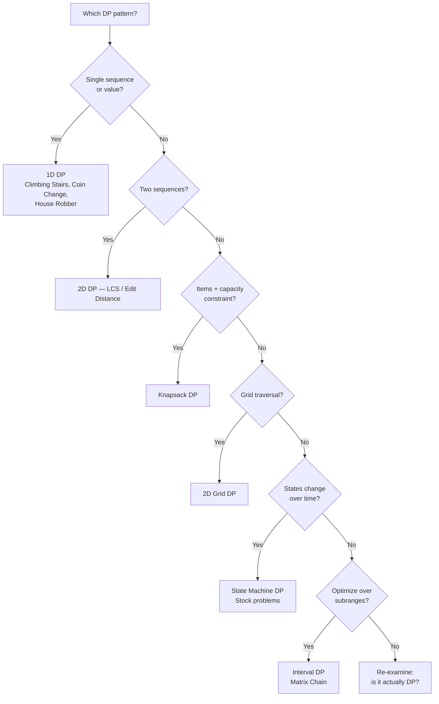

# 🧩 Dynamic Programming — Quick Reference

---

## The 4-Step Framework

| Step | Question | Example (Climbing Stairs) |
|------|----------|--------------------------|
| **1. State** | What info do I need at each step? | `dp[i]` = ways to reach step `i` |
| **2. Recurrence** | How does current state relate to previous? | `dp[i] = dp[i-1] + dp[i-2]` |
| **3. Base case** | What are the trivially known answers? | `dp[0] = 1, dp[1] = 1` |
| **4. Answer** | Where is the final answer? | `dp[n]` |

---

## Top-Down (Memoization) Template

```python
from functools import lru_cache

def solve(params):
    @lru_cache(maxsize=None)
    def dp(state):
        if base_case(state):
            return base_value
        return recurrence(dp, state)  # calls dp on sub-states
    
    return dp(initial_state)
```

**Or with a dict:**
```python
def solve(params):
    memo = {}
    
    def dp(state):
        if state in memo: return memo[state]
        if base_case(state): return base_value
        memo[state] = recurrence(dp, state)
        return memo[state]
    
    return dp(initial_state)
```

---

## Bottom-Up (Tabulation) Template

```python
def solve(params):
    dp = [0] * (n + 1)       # or 2D: [[0]*(m+1) for _ in range(n+1)]
    dp[0] = base_value        # base case(s)
    
    for i in range(1, n + 1): # fill table in dependency order
        dp[i] = recurrence using dp[i-1], dp[i-2], etc.
    
    return dp[n]
```

> **Top-down:** easier to think about, handles sparse states well  
> **Bottom-up:** no recursion overhead, easier to optimize space

---

## DP Categories & Example Problems

### 1D DP
| Problem | State | Recurrence |
|---------|-------|------------|
| Climbing Stairs | `dp[i]` = ways to step i | `dp[i] = dp[i-1] + dp[i-2]` |
| House Robber | `dp[i]` = max money through house i | `dp[i] = max(dp[i-1], dp[i-2] + nums[i])` |
| Coin Change | `dp[i]` = min coins for amount i | `dp[i] = min(dp[i - c] + 1) for c in coins` |

### 2D DP
| Problem | State | Recurrence |
|---------|-------|------------|
| 0/1 Knapsack | `dp[i][w]` = max value, i items, capacity w | `dp[i][w] = max(dp[i-1][w], dp[i-1][w-wt[i]] + val[i])` |
| LCS | `dp[i][j]` = LCS of s1[:i], s2[:j] | match: `dp[i-1][j-1]+1`; else: `max(dp[i-1][j], dp[i][j-1])` |
| Edit Distance | `dp[i][j]` = edits for s1[:i] → s2[:j] | match: `dp[i-1][j-1]`; else: `1 + min(dp[i-1][j], dp[i][j-1], dp[i-1][j-1])` |
| Grid Paths | `dp[i][j]` = paths to (i,j) | `dp[i][j] = dp[i-1][j] + dp[i][j-1]` |

### State Machine DP
| Problem | States | Transitions |
|---------|--------|-------------|
| Stock Buy/Sell | `hold[i]`, `cash[i]` | `hold[i] = max(hold[i-1], cash[i-1] - price[i])` |
| | | `cash[i] = max(cash[i-1], hold[i-1] + price[i])` |

### Interval DP
| Problem | State | Recurrence |
|---------|-------|------------|
| Matrix Chain | `dp[i][j]` = min cost for matrices i..j | `dp[i][j] = min(dp[i][k] + dp[k+1][j] + cost(i,k,j))` for k in [i,j) |

---

## Code Templates

### 1D DP — Coin Change
```python
def coin_change(coins, amount):
    dp = [float('inf')] * (amount + 1)
    dp[0] = 0
    for i in range(1, amount + 1):
        for c in coins:
            if c <= i:
                dp[i] = min(dp[i], dp[i - c] + 1)
    return dp[amount] if dp[amount] != float('inf') else -1
```

### 2D DP — 0/1 Knapsack
```python
def knapsack(weights, values, capacity):
    n = len(weights)
    dp = [[0] * (capacity + 1) for _ in range(n + 1)]
    
    for i in range(1, n + 1):
        for w in range(capacity + 1):
            dp[i][w] = dp[i-1][w]                          # skip item
            if weights[i-1] <= w:
                dp[i][w] = max(dp[i][w], dp[i-1][w - weights[i-1]] + values[i-1])  # take item
    
    return dp[n][capacity]
```

### 2D DP — Longest Common Subsequence
```python
def lcs(s1, s2):
    m, n = len(s1), len(s2)
    dp = [[0] * (n + 1) for _ in range(m + 1)]
    
    for i in range(1, m + 1):
        for j in range(1, n + 1):
            if s1[i-1] == s2[j-1]:
                dp[i][j] = dp[i-1][j-1] + 1
            else:
                dp[i][j] = max(dp[i-1][j], dp[i][j-1])
    
    return dp[m][n]
```

### 2D DP — Grid Unique Paths
```python
def unique_paths(m, n):
    dp = [[1] * n for _ in range(m)]
    for i in range(1, m):
        for j in range(1, n):
            dp[i][j] = dp[i-1][j] + dp[i][j-1]
    return dp[m-1][n-1]
```

---

## Space Optimization (Rolling Array)

**Key idea:** if `dp[i]` only depends on `dp[i-1]`, keep only 2 rows (or even 1 row).

### 1D: Two variables
```python
# House Robber — O(1) space
prev2, prev1 = 0, 0
for num in nums:
    prev2, prev1 = prev1, max(prev1, prev2 + num)
return prev1
```

### 2D → 1D: Single row
```python
# Knapsack — O(capacity) space
dp = [0] * (capacity + 1)
for i in range(n):
    for w in range(capacity, weights[i] - 1, -1):  # iterate BACKWARDS
        dp[w] = max(dp[w], dp[w - weights[i]] + values[i])
```

> **Critical:** iterate capacity **backwards** in 0/1 knapsack to avoid using an item twice.

---

## Pattern Decision Flowchart



---

## Top-Down vs Bottom-Up

| | Top-Down (Memo) | Bottom-Up (Tab) |
|---|----------------|-----------------|
| Approach | Recursive + cache | Iterative, fill table |
| Pros | Natural, only computes needed states | No recursion overhead, easy space opt |
| Cons | Stack overflow risk, function call overhead | Must figure out fill order, computes all states |
| When to use | Sparse states, complex transitions | Dense states, need space optimization |

---

## Common Mistakes

| Mistake | Fix |
|---------|-----|
| Wrong base case | Trace the smallest inputs by hand |
| Wrong iteration order (bottom-up) | Ensure dependencies are computed before current cell |
| Off-by-one in table size | Usually need `n+1` or `(m+1) x (n+1)` table |
| Forgetting to handle impossible states | Initialize with `inf` or `-inf` where appropriate |
| Space opt: wrong direction in knapsack | 0/1 knapsack → iterate capacity **backwards** |
| Confusing 0/1 knapsack vs unbounded | 0/1: each item once (reverse); unbounded: items reusable (forward) |
| Not recognizing overlapping subproblems | If recursion tree repeats states → add memoization |

---

## Key Intuitions

- **DP = recursion + memoization** — if brute force is exponential with repeated work, DP helps
- **"How many ways" or "min/max cost"** → likely DP
- **State = the minimum info needed** to make the next decision
- **If greedy fails** (counterexample exists) → try DP
- **Draw the recursion tree** — if you see repeated nodes, it's DP
- **Start top-down** for clarity, convert to bottom-up for performance
