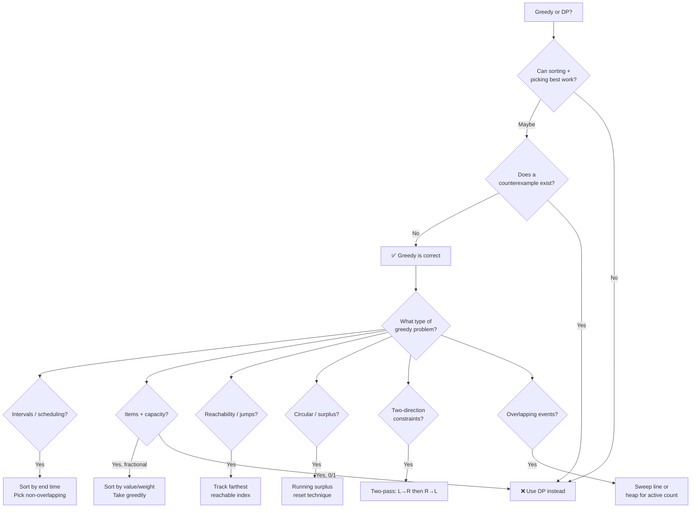

# ⚡ Greedy Algorithms — Quick Reference

---

## When Does Greedy Work?

Two conditions must hold:

1. **Greedy Choice Property** — a locally optimal choice leads to a globally optimal solution
2. **Optimal Substructure** — optimal solution contains optimal solutions to subproblems

> **Litmus test:** Can you sort + pick the best at each step without backtracking? If no counterexample breaks it → greedy works.

---

## Greedy vs DP

| | Greedy | Dynamic Programming |
|---|--------|-------------------|
| Approach | Make best local choice, never reconsider | Consider all choices, pick optimal |
| Proof needed | Greedy choice property | Optimal substructure + overlapping subproblems |
| Time | Usually O(n log n) for sort + O(n) scan | Usually O(n²) or O(n × capacity) |
| Space | Usually O(1) extra | O(n) or O(n²) for table |
| When to use | Choice is always clear from local info | Need to compare multiple paths |
| Example | Interval scheduling | 0/1 Knapsack |

---

## All Patterns

### 1. Interval Scheduling (Sort by End Time)
**Insight:** Always pick the interval that ends earliest → leaves max room for others.

```python
def max_non_overlapping(intervals):
    intervals.sort(key=lambda x: x[1])  # sort by end time
    count, end = 0, float('-inf')
    for s, e in intervals:
        if s >= end:       # no overlap
            count += 1
            end = e
    return count
```

> **Variant — min intervals to remove:** `len(intervals) - max_non_overlapping`

---

### 2. Fractional Knapsack (Sort by Value/Weight Ratio)
**Insight:** Take items with highest value-per-unit-weight first; take fractions of the last item.

```python
def fractional_knapsack(items, capacity):
    items.sort(key=lambda x: x[1] / x[0], reverse=True)  # (weight, value)
    total = 0
    for w, v in items:
        if capacity >= w:
            total += v
            capacity -= w
        else:
            total += v * (capacity / w)  # take fraction
            break
    return total
```

---

### 3. Jump Game (Track Farthest Reachable)
**Insight:** Greedily track the farthest index you can reach.

```python
def can_jump(nums):
    farthest = 0
    for i in range(len(nums)):
        if i > farthest: return False
        farthest = max(farthest, i + nums[i])
    return True
```

**Jump Game II — minimum jumps:**
```python
def min_jumps(nums):
    jumps = cur_end = farthest = 0
    for i in range(len(nums) - 1):
        farthest = max(farthest, i + nums[i])
        if i == cur_end:
            jumps += 1
            cur_end = farthest
    return jumps
```

---

### 4. Gas Station (Running Surplus)
**Insight:** If total gas >= total cost, a solution exists. Start where cumulative surplus resets from negative.

```python
def gas_station(gas, cost):
    if sum(gas) < sum(cost): return -1
    start = surplus = 0
    for i in range(len(gas)):
        surplus += gas[i] - cost[i]
        if surplus < 0:
            start = i + 1
            surplus = 0
    return start
```

---

### 5. Two-Pass Greedy (Candy Problem)
**Insight:** Satisfy one direction first (left→right), then the other (right→left), take max.

```python
def candy(ratings):
    n = len(ratings)
    candies = [1] * n
    
    for i in range(1, n):                    # left to right
        if ratings[i] > ratings[i-1]:
            candies[i] = candies[i-1] + 1
    
    for i in range(n-2, -1, -1):             # right to left
        if ratings[i] > ratings[i+1]:
            candies[i] = max(candies[i], candies[i+1] + 1)
    
    return sum(candies)
```

---

### 6. Event Sweep / Meeting Rooms
**Insight:** Sort events by start (or separate start/end), sweep with a counter or heap.

```python
import heapq

def min_meeting_rooms(intervals):
    intervals.sort(key=lambda x: x[0])
    heap = []  # end times of active meetings
    for s, e in intervals:
        if heap and heap[0] <= s:
            heapq.heappop(heap)   # room freed up
        heapq.heappush(heap, e)
    return len(heap)
```

**Alternative — sweep line approach:**
```python
def min_meeting_rooms_sweep(intervals):
    events = []
    for s, e in intervals:
        events.append((s, 1))    # meeting starts
        events.append((e, -1))   # meeting ends
    events.sort()
    
    rooms = max_rooms = 0
    for _, delta in events:
        rooms += delta
        max_rooms = max(max_rooms, rooms)
    return max_rooms
```

---

## Pattern Summary Table

| Pattern | Sort By | Greedy Choice | Time |
|---------|---------|---------------|------|
| Interval scheduling | End time | Pick earliest ending | O(n log n) |
| Fractional knapsack | Value/weight ratio | Take highest ratio first | O(n log n) |
| Jump game | — (index order) | Track farthest reachable | O(n) |
| Gas station | — (index order) | Reset start at deficit | O(n) |
| Candy (two-pass) | — (two sweeps) | Satisfy L→R then R→L | O(n) |
| Meeting rooms | Start time | Track overlaps with heap | O(n log n) |
| Task scheduler | Frequency | Schedule most frequent first | O(n) |
| Huffman coding | Frequency | Merge two smallest first | O(n log n) |

---

## Pattern Decision Flowchart



---

## Proving Greedy Correctness

Two standard techniques:

1. **Exchange Argument** — show you can swap any non-greedy choice with the greedy choice without worsening the solution
2. **Greedy Stays Ahead** — show that at every step, greedy is at least as good as any other strategy

> You don't need formal proofs in interviews, but you **should** check for counterexamples.

---

## Common Mistakes

| Mistake | Fix |
|---------|-----|
| Assuming greedy works without checking | Always test with a counterexample first |
| Wrong sorting criterion | Interval scheduling: sort by **end** (not start) |
| Using greedy for 0/1 knapsack | 0/1 knapsack needs DP — greedy only works for fractional |
| Not handling ties in sorting | Define clear tiebreaker rules |
| Forgetting edge cases | Empty input, single element, all same values |
| Greedy on problems needing future info | If optimal choice depends on future decisions → DP |

---

## Key Intuitions

- **Greedy = "never look back"** — make the best choice now, commit to it
- **If greedy works, it's usually simpler and faster than DP** — O(n log n) vs O(n²)
- **Sorting is almost always the first step** — the right sort order makes the greedy choice obvious
- **Counterexample kills greedy** — one failing case means you need DP or another approach
- **Interval problems → sort by end time** (this is the most common greedy pattern in interviews)
- **Two-pass technique** — when constraints come from both directions, handle each separately
