# Math for ML — Cheatsheet

Quick reference for the math foundations used in machine learning.

---

## Linear Algebra

### Vector Operations

| Operation | Math | NumPy |
|-----------|------|-------|
| Create vector | $\mathbf{v} = [v_1, v_2, \ldots]$ | `np.array([1, 2, 3])` |
| Addition | $\mathbf{a} + \mathbf{b}$ | `a + b` |
| Scalar multiply | $c \cdot \mathbf{v}$ | `c * v` |
| Dot product | $\mathbf{a} \cdot \mathbf{b} = \sum a_i b_i$ | `np.dot(a, b)` or `a @ b` |
| L1 norm | $\|\mathbf{v}\|_1 = \sum |v_i|$ | `np.linalg.norm(v, ord=1)` |
| L2 norm | $\|\mathbf{v}\|_2 = \sqrt{\sum v_i^2}$ | `np.linalg.norm(v)` |
| Unit vector | $\hat{\mathbf{v}} = \mathbf{v} / \|\mathbf{v}\|$ | `v / np.linalg.norm(v)` |
| Cosine similarity | $\cos\theta = \frac{\mathbf{a} \cdot \mathbf{b}}{\|\mathbf{a}\| \|\mathbf{b}\|}$ | `np.dot(a,b) / (norm(a)*norm(b))` |

### Matrix Operations

| Operation | Math | NumPy |
|-----------|------|-------|
| Create matrix | $A_{m \times n}$ | `np.array([[1,2],[3,4]])` |
| Multiply | $AB$ | `A @ B` |
| Transpose | $A^T$ | `A.T` |
| Identity | $I$ | `np.eye(n)` |
| Inverse | $A^{-1}$ | `np.linalg.inv(A)` |
| Determinant | $\det(A)$ | `np.linalg.det(A)` |
| Eigendecomposition | $Av = \lambda v$ | `np.linalg.eig(A)` |
| Rank | $\text{rank}(A)$ | `np.linalg.matrix_rank(A)` |
| Solve $Ax = b$ | $x = A^{-1}b$ | `np.linalg.solve(A, b)` |

### Key Properties

- $(AB)^T = B^T A^T$
- $(AB)^{-1} = B^{-1} A^{-1}$
- $A A^{-1} = A^{-1} A = I$
- $\det(AB) = \det(A) \cdot \det(B)$
- $\det(A) = 0 \Rightarrow$ A is singular (no inverse)
- $A^T A$ is always symmetric and positive semi-definite

---

## Calculus

### Derivative Rules

| Rule | Formula |
|------|---------|
| Power | $\frac{d}{dx} x^n = n x^{n-1}$ |
| Constant | $\frac{d}{dx} c = 0$ |
| Sum | $(f + g)' = f' + g'$ |
| Product | $(fg)' = f'g + fg'$ |
| Chain | $(f(g(x)))' = f'(g(x)) \cdot g'(x)$ |
| Exponential | $\frac{d}{dx} e^x = e^x$ |
| Logarithm | $\frac{d}{dx} \ln x = \frac{1}{x}$ |

### Gradient Descent

**Update rule:**

$$w_{\text{new}} = w_{\text{old}} - \alpha \cdot \nabla L(w_{\text{old}})$$

where:
- $\alpha$ = learning rate (step size)
- $\nabla L$ = gradient of the loss function
- $w$ = model parameters (weights)

**Gradient:**

$$\nabla f(x_1, x_2, \ldots) = \left[\frac{\partial f}{\partial x_1}, \frac{\partial f}{\partial x_2}, \ldots\right]$$

Points in the direction of steepest **increase**. Negate it to go downhill.

**Common Loss Gradients:**

| Loss | Formula | Gradient w.r.t. prediction |
|------|---------|---------------------------|
| MSE | $\frac{1}{n}\sum(y - \hat{y})^2$ | $\frac{-2}{n}\sum(y - \hat{y})$ |
| Cross-entropy | $-\sum y \log \hat{y}$ | $-y / \hat{y}$ |

**Learning Rate Guidelines:**

| Learning Rate | Behavior |
|---------------|----------|
| Too small (< 0.001) | Very slow convergence |
| Good range (0.001 – 0.1) | Stable convergence |
| Too large (> 1.0) | Oscillation or divergence |

---

## Probability & Statistics

### Core Formulas

| Concept | Formula |
|---------|---------|
| Complement | $P(\bar{A}) = 1 - P(A)$ |
| Union | $P(A \cup B) = P(A) + P(B) - P(A \cap B)$ |
| Conditional | $P(A|B) = \frac{P(A \cap B)}{P(B)}$ |
| Independence | $P(A \cap B) = P(A) \cdot P(B)$ |
| **Bayes' Theorem** | $P(A|B) = \frac{P(B|A) \cdot P(A)}{P(B)}$ |

### Common Distributions

| Distribution | PMF/PDF | Mean | Variance | NumPy |
|-------------|---------|------|----------|-------|
| Bernoulli(p) | $P(X=1) = p$ | $p$ | $p(1-p)$ | `np.random.binomial(1, p)` |
| Binomial(n,p) | $\binom{n}{k} p^k (1-p)^{n-k}$ | $np$ | $np(1-p)$ | `np.random.binomial(n, p)` |
| Uniform(a,b) | $\frac{1}{b-a}$ | $\frac{a+b}{2}$ | $\frac{(b-a)^2}{12}$ | `np.random.uniform(a, b)` |
| Normal(μ,σ²) | $\frac{1}{\sigma\sqrt{2\pi}} e^{-\frac{(x-\mu)^2}{2\sigma^2}}$ | $\mu$ | $\sigma^2$ | `np.random.normal(μ, σ)` |

### Descriptive Statistics

| Statistic | Formula | NumPy |
|-----------|---------|-------|
| Mean | $\bar{x} = \frac{1}{n}\sum x_i$ | `np.mean(x)` |
| Variance | $\sigma^2 = \frac{1}{n}\sum(x_i - \bar{x})^2$ | `np.var(x)` |
| Std Dev | $\sigma = \sqrt{\sigma^2}$ | `np.std(x)` |
| Correlation | $r = \frac{\sum(x_i-\bar{x})(y_i-\bar{y})}{\sqrt{\sum(x_i-\bar{x})^2 \sum(y_i-\bar{y})^2}}$ | `np.corrcoef(x, y)[0,1]` |

### Key Theorems

**Central Limit Theorem:** The mean of a large number of independent samples from *any* distribution is approximately Normal.

**Law of Large Numbers:** As sample size grows, the sample mean converges to the true mean.

---

## ML Technique → Math Concept Flowchart

```mermaid
flowchart TD
    LR[Linear Regression] --> LA[Linear Algebra<br>Normal Equation]
    LR --> GD[Calculus<br>Gradient Descent]

    NN[Neural Networks] --> MM[Linear Algebra<br>Matrix Multiplication]
    NN --> BP[Calculus<br>Backprop = Chain Rule]
    NN --> SGD[Calculus<br>Stochastic GD]

    PCA[PCA] --> EIG[Linear Algebra<br>Eigenvalues]

    NB[Naive Bayes] --> BAYES[Probability<br>Bayes' Theorem]

    REG[Regularization<br>L1/L2] --> NORMS[Linear Algebra<br>Norms]

    CV[Cross-Validation] --> BV[Statistics<br>Bias-Variance]

    LO[Logistic Regression] --> MLE[Statistics<br>Max Likelihood]
    LO --> GD

    SVM[SVM] --> DOT[Linear Algebra<br>Dot Product / Kernels]

    BN[Batch Normalization] --> STATS[Statistics<br>Mean / Variance]

    style LA fill:#e3f2fd
    style MM fill:#e3f2fd
    style EIG fill:#e3f2fd
    style NORMS fill:#e3f2fd
    style DOT fill:#e3f2fd
    style GD fill:#fff3e0
    style BP fill:#fff3e0
    style SGD fill:#fff3e0
    style BAYES fill:#e8f5e9
    style BV fill:#e8f5e9
    style MLE fill:#e8f5e9
    style STATS fill:#e8f5e9
```



**Color key:** 🔵 Linear Algebra | 🟠 Calculus | 🟢 Probability & Statistics

---

## NumPy Quick Reference

```python
import numpy as np

# === Vectors ===
v = np.array([1, 2, 3])
np.dot(a, b)                    # dot product
np.linalg.norm(v)               # L2 norm
np.linalg.norm(v, ord=1)        # L1 norm
np.cross(a, b)                  # cross product (3D)

# === Matrices ===
A = np.array([[1,2],[3,4]])
A.T                             # transpose
A @ B                           # matrix multiply
np.eye(n)                       # identity matrix
np.linalg.inv(A)                # inverse
np.linalg.det(A)                # determinant
np.linalg.eig(A)                # eigenvalues & eigenvectors
np.linalg.solve(A, b)           # solve Ax = b
np.linalg.matrix_rank(A)        # rank

# === Statistics ===
np.mean(x)                      # mean
np.var(x)                       # variance (population)
np.std(x)                       # standard deviation
np.median(x)                    # median
np.corrcoef(x, y)               # correlation matrix
np.cov(x, y)                    # covariance matrix
np.percentile(x, 95)            # 95th percentile

# === Random Sampling ===
np.random.seed(42)              # reproducibility
np.random.rand(n)               # uniform [0, 1)
np.random.randn(n)              # standard normal N(0,1)
np.random.normal(mu, sigma, n)  # normal N(mu, sigma)
np.random.uniform(a, b, n)     # uniform [a, b)
np.random.binomial(n, p, size)  # binomial
np.random.choice(arr, size)     # random selection
```
