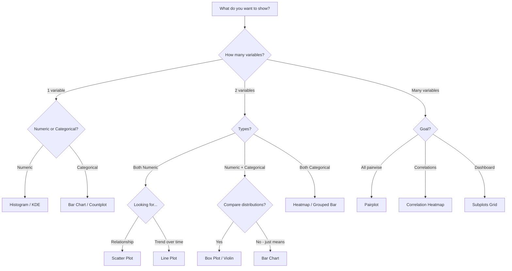

# NumPy, Pandas & Visualization — Cheatsheet

---

## NumPy

### Creating Arrays
```python
np.array([1, 2, 3])                  # from list
np.zeros((3, 4))                     # 3×4 zeros
np.ones((2, 3))                      # 2×3 ones
np.eye(5)                            # 5×5 identity
np.arange(0, 10, 2)                  # [0, 2, 4, 6, 8]
np.linspace(0, 1, 5)                 # [0, .25, .5, .75, 1]
np.random.default_rng(42).random(5)  # 5 uniform [0, 1)
```

### Indexing & Slicing
```python
arr[0]            # first element
arr[-1]           # last element
arr[2:5]          # slice [2, 3, 4]
arr[::2]          # every other element
grid[1, 3]        # row 1, col 3
grid[:, -1]       # last column
grid[1:3, :]      # rows 1-2, all cols
arr[arr > 5]      # boolean indexing
arr[[0, 3, 7]]    # fancy indexing
```

### Reshaping
```python
arr.reshape(3, 4)    # reshape to 3×4
arr.reshape(2, -1)   # -1 = auto-calculate
arr.flatten()        # back to 1D
arr.T                # transpose
arr.ravel()          # flatten (returns view if possible)
```

### Broadcasting Rules
```
Compare shapes right to left:
  (3, 4) + (4,)   → OK  (4 == 4)
  (3, 4) + (3, 1) → OK  (1 broadcasts to 4)
  (3, 4) + (3,)   → ERROR (4 ≠ 3)
```

### Math Operations
```python
a + b, a * b, a / b        # element-wise
a ** 2                      # square each
np.sqrt(a), np.exp(a)      # element-wise functions
np.dot(a, b)               # dot product (1D)
A @ B                      # matrix multiply (2D)
arr.sum(axis=0)            # sum along columns
arr.mean(axis=1)           # mean along rows
arr.std(), arr.min(), arr.max()
np.corrcoef(x, y)          # correlation matrix
```

### Linear Algebra — `np.linalg`
```python
np.linalg.solve(A, b)     # solve Ax = b
np.linalg.inv(A)          # inverse
np.linalg.det(A)          # determinant
np.linalg.eig(A)          # eigenvalues + eigenvectors
np.linalg.norm(v)         # L2 norm
```

### Random — `np.random.default_rng`
```python
rng = np.random.default_rng(42)
rng.random(5)                         # uniform [0, 1)
rng.standard_normal(5)                # normal μ=0, σ=1
rng.integers(1, 100, size=5)          # random ints [1, 100)
rng.choice(['a', 'b', 'c'], size=3)   # random pick
rng.shuffle(arr)                       # in-place shuffle
rng.normal(loc=50, scale=10, size=100) # normal distribution
```

---

## Pandas

### Selection — `loc` / `iloc` / Boolean
```python
df['col']                      # single column (Series)
df[['col1', 'col2']]          # multiple columns (DataFrame)
df.loc[0:5, 'col']            # by label (inclusive)
df.iloc[0:5, 0:3]             # by position (exclusive end)
df[df['col'] > 50]            # boolean filter
df[(df['a'] > 5) & (df['b'] < 10)]  # combined filter
df.query('col > 50 and year == 2024')  # SQL-like
```

### Exploring Data
```python
df.head(), df.tail()
df.shape, df.dtypes
df.info(), df.describe()
df['col'].value_counts()
df.isna().sum()
df.nunique()
```

### Groupby & Aggregation
```python
df.groupby('col').mean()
df.groupby('col').agg(
    avg=('value', 'mean'),
    total=('value', 'sum'),
    count=('value', 'count')
)
df.groupby('col')['val'].transform('mean')  # broadcast back
df.groupby(['a', 'b']).size()               # multi-level
```

### Merge Types
```python
pd.merge(left, right, on='key', how='inner')   # only matches
pd.merge(left, right, on='key', how='left')    # all from left
pd.merge(left, right, on='key', how='right')   # all from right
pd.merge(left, right, on='key', how='outer')   # everything
pd.concat([df1, df2], ignore_index=True)        # stack rows
pd.concat([df1, df2], axis=1)                   # stack columns
```

### Missing Data
```python
df.isna().sum()                        # count NaNs per column
df.dropna()                            # drop rows with any NaN
df.dropna(subset=['col'])              # drop if NaN in specific col
df['col'].fillna(df['col'].mean())     # fill with mean
df.fillna(method='ffill')             # forward fill
df.fillna(method='bfill')             # backward fill
```

### Data Transformation
```python
df['col'].apply(func)                  # apply function to each element
df['col'].map({'a': 1, 'b': 2})       # map values
df['col'].replace('old', 'new')        # replace values
df['col'].astype(int)                  # change dtype
pd.cut(df['col'], bins=3)             # bin into categories
pd.get_dummies(df['col'])             # one-hot encoding
```

### DateTime
```python
pd.to_datetime(df['date'])             # parse dates
df['date'].dt.year                     # extract year
df['date'].dt.month                    # extract month
df['date'].dt.day_name()               # day name
df.resample('ME').sum()                # monthly resample
df.resample('W').mean()                # weekly resample
```

### String Operations
```python
df['col'].str.lower()                  # lowercase
df['col'].str.upper()                  # uppercase
df['col'].str.contains('pattern')      # regex search
df['col'].str.split('@').str[0]        # split + select
df['col'].str.replace('a', 'b')        # replace
df['col'].str.len()                    # string length
```

---

## Matplotlib

### Core Pattern
```python
fig, ax = plt.subplots(figsize=(8, 5))
ax.plot(x, y)
ax.set_xlabel('X'), ax.set_ylabel('Y'), ax.set_title('Title')
ax.legend()
plt.tight_layout()
plt.show()
```

### Plot Types — One Liners
```python
ax.plot(x, y)                                      # line
ax.bar(categories, values)                         # vertical bar
ax.barh(categories, values)                        # horizontal bar
ax.hist(data, bins=25)                             # histogram
ax.scatter(x, y, c=colors, s=sizes)               # scatter
ax.boxplot([d1, d2, d3], labels=['A', 'B', 'C'])  # box plot
ax.imshow(matrix, cmap='viridis')                  # heatmap
```

### Subplots
```python
fig, axes = plt.subplots(2, 3, figsize=(15, 10))
axes[0, 0].plot(x, y)     # top-left
axes[1, 2].bar(c, v)      # bottom-right
plt.tight_layout()
```

### Styling
```python
ax.spines['top'].set_visible(False)      # remove top spine
ax.spines['right'].set_visible(False)    # remove right spine
ax.grid(True, alpha=0.3)                 # light grid
ax.set_xlim(0, 10)                       # axis limits
fig.savefig('plot.png', dpi=150, bbox_inches='tight')
```

---

## Seaborn — Statistical Plots

```python
sns.set_theme(style='whitegrid')

sns.histplot(data=df, x='col', hue='group', kde=True)
sns.scatterplot(data=df, x='x', y='y', hue='group', size='val')
sns.boxplot(data=df, x='group', y='value')
sns.violinplot(data=df, x='group', y='value', inner='quartile')
sns.heatmap(corr, annot=True, cmap='RdBu_r', center=0)
sns.pairplot(df, hue='group')
sns.countplot(data=df, x='category', hue='group')
sns.regplot(data=df, x='x', y='y')
sns.kdeplot(data=df, x='col', hue='group', fill=True)
sns.jointplot(data=df, x='x', y='y', kind='scatter')
```

---

## Which Plot Type? — Decision Flowchart


