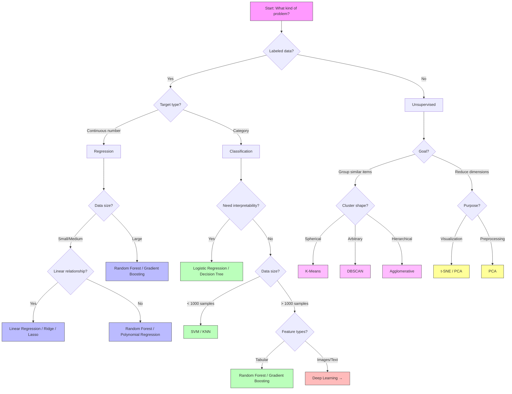

# 02 — Classical ML Cheatsheet

## Algorithm Comparison

| Algorithm | Type | Time Complexity (train) | Pros | Cons | When to Use |
|-----------|------|------------------------|------|------|-------------|
| Linear Regression | Regression | O(n·d²) | Fast, interpretable, baseline | Only linear relationships | Continuous target, linear data |
| Polynomial Regression | Regression | O(n·d^k) | Captures curves | Overfits easily at high degree | Non-linear but smooth relationships |
| Ridge (L2) | Regression | O(n·d²) | Prevents overfitting, stable | No feature selection | Many features, multicollinearity |
| Lasso (L1) | Regression | O(n·d²) | Feature selection, sparse | Can zero useful features | Want automatic feature selection |
| Logistic Regression | Classification | O(n·d) | Fast, probabilistic, interpretable | Linear boundaries only | Binary/multiclass baseline |
| KNN | Both | O(1) train / O(n·d) predict | Simple, no training | Slow prediction, curse of dim. | Small data, quick baseline |
| Decision Tree | Both | O(n·d·log n) | Interpretable, handles mixed types | Overfits easily | Need explainability |
| Random Forest | Both | O(k·n·d·log n) | Robust, hard to mess up | Slow, black box | General-purpose tabular data |
| SVM | Both | O(n²·d) to O(n³) | Effective in high-dim, kernel trick | Slow on large data, needs scaling | Medium data, non-linear boundaries |
| K-Means | Clustering | O(n·k·d·i) | Fast, simple | Assumes spherical clusters, need k | Well-separated round clusters |
| DBSCAN | Clustering | O(n·log n) | Arbitrary shapes, finds outliers | Sensitive to eps | Non-spherical, noisy data |
| PCA | Dim. Reduction | O(n·d²) | Fast, deterministic | Linear only | Preprocessing, visualization |
| t-SNE | Dim. Reduction | O(n²) | Beautiful visualizations | Slow, non-deterministic | 2D/3D visualization only |

---

## Evaluation Metrics

### Regression

| Metric | Formula | When to Use |
|--------|---------|-------------|
| MSE | `(1/n) Σ(y - ŷ)²` | General; penalizes big errors |
| RMSE | `√MSE` | Same units as target; most reported |
| MAE | `(1/n) Σ|y - ŷ|` | Robust to outliers |
| R² | `1 - Σ(y-ŷ)² / Σ(y-ȳ)²` | Fraction of variance explained (1.0 = perfect) |

### Classification

| Metric | Formula | When to Use |
|--------|---------|-------------|
| Accuracy | `(TP+TN) / total` | Balanced classes only |
| Precision | `TP / (TP+FP)` | Cost of false positives is high (spam filter) |
| Recall | `TP / (TP+FN)` | Cost of false negatives is high (cancer detection) |
| F1 | `2·P·R / (P+R)` | Balance precision and recall |
| AUC-ROC | Area under ROC curve | Compare models across all thresholds |

---

## sklearn API Patterns

```python
# Fit / Predict pattern (supervised)
model.fit(X_train, y_train)
y_pred = model.predict(X_test)
score = model.score(X_test, y_test)

# Fit / Transform pattern (preprocessing)
scaler.fit(X_train)
X_train_scaled = scaler.transform(X_train)
X_test_scaled = scaler.transform(X_test)
# Shortcut:
X_train_scaled = scaler.fit_transform(X_train)

# Pipeline
from sklearn.pipeline import Pipeline
pipe = Pipeline([
    ('scaler', StandardScaler()),
    ('model', LogisticRegression()),
])
pipe.fit(X_train, y_train)
pipe.predict(X_test)

# Cross-validation
from sklearn.model_selection import cross_val_score
scores = cross_val_score(pipe, X, y, cv=5, scoring='accuracy')

# GridSearch
from sklearn.model_selection import GridSearchCV
grid = GridSearchCV(model, param_grid, cv=5, scoring='accuracy')
grid.fit(X_train, y_train)
grid.best_params_
grid.best_score_
```

---

## Pipeline Template

```python
from sklearn.pipeline import Pipeline
from sklearn.compose import ColumnTransformer
from sklearn.preprocessing import StandardScaler, OneHotEncoder
from sklearn.impute import SimpleImputer

numerical_features = ['age', 'income', 'score']
categorical_features = ['city', 'category']

num_pipeline = Pipeline([
    ('imputer', SimpleImputer(strategy='median')),
    ('scaler', StandardScaler()),
])

cat_pipeline = Pipeline([
    ('imputer', SimpleImputer(strategy='most_frequent')),
    ('encoder', OneHotEncoder(drop='first', sparse_output=False)),
])

preprocessor = ColumnTransformer([
    ('num', num_pipeline, numerical_features),
    ('cat', cat_pipeline, categorical_features),
])

full_pipeline = Pipeline([
    ('preprocessing', preprocessor),
    ('model', RandomForestClassifier(n_estimators=100)),
])

# Use it
full_pipeline.fit(X_train, y_train)
full_pipeline.predict(X_test)
cross_val_score(full_pipeline, X, y, cv=5)
```

---

## Which ML Algorithm Should I Use?



---

## Quick Reference

**Always start with**: Logistic Regression (classification) or Linear Regression (regression) as your baseline.

**Default strong model**: Random Forest — works well on almost everything tabular.

**Don't forget**:
- Scale features before KNN, SVM, Logistic Regression
- Use cross-validation, not a single train/test split
- Check for class imbalance before trusting accuracy
- Put everything in a Pipeline to avoid data leakage
