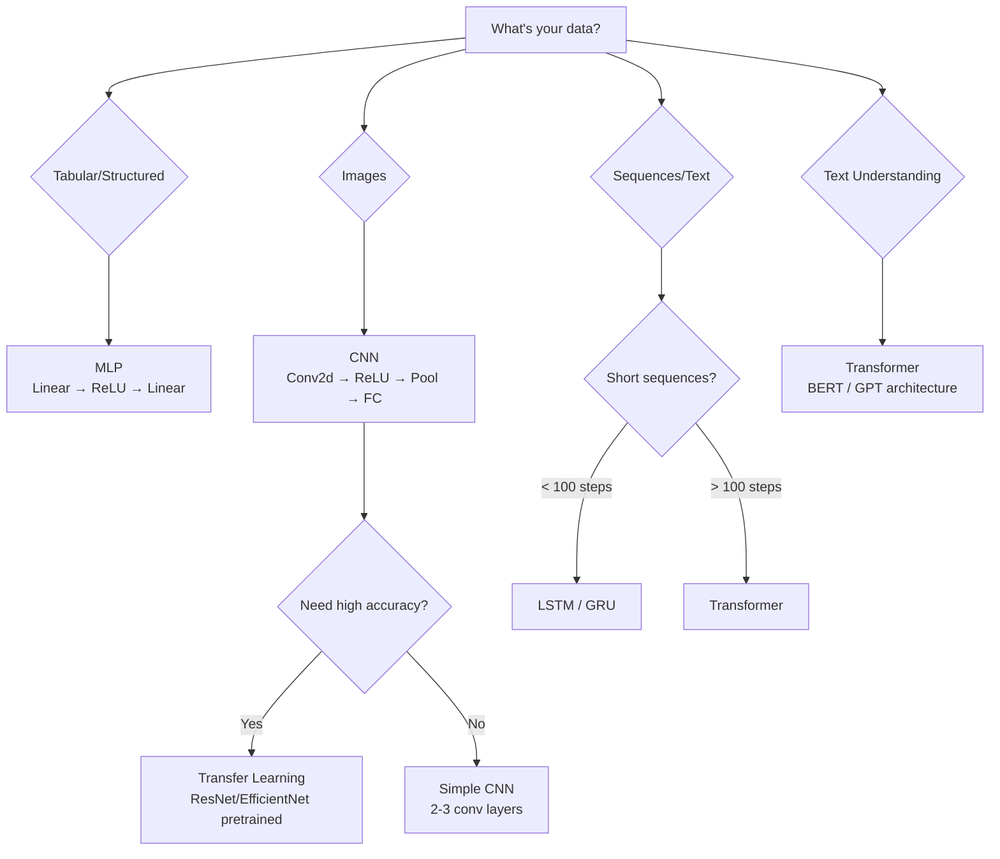

# Deep Learning Cheatsheet

## Neural Network Architecture

```
Input Layer          Hidden Layers              Output Layer
 (features)         (learned features)          (predictions)

  x1 ─────┐
           ├──► [h1  h2  h3  h4] ──┐
  x2 ─────┤         (ReLU)         ├──► [o1  o2] (softmax)
           ├──► [h5  h6  h7  h8] ──┘
  x3 ─────┘         (ReLU)

  Each arrow = weight. Each node = weighted sum + bias + activation.
```

---

## PyTorch Training Loop Template

```python
# 1. Data
train_loader = DataLoader(dataset, batch_size=32, shuffle=True)

# 2. Model
model = MyModel().to(device)

# 3. Loss + Optimizer
criterion = nn.CrossEntropyLoss()
optimizer = optim.Adam(model.parameters(), lr=1e-3)

# 4. Train
for epoch in range(n_epochs):
    model.train()
    for X_batch, y_batch in train_loader:
        X_batch, y_batch = X_batch.to(device), y_batch.to(device)

        output = model(X_batch)           # forward
        loss = criterion(output, y_batch) # compute loss

        optimizer.zero_grad()             # clear gradients
        loss.backward()                   # backprop
        optimizer.step()                  # update weights

# 5. Evaluate
model.eval()
with torch.no_grad():
    predictions = model(X_test.to(device))
```

---

## Common Layers and Dimensions

| Layer | PyTorch | Input → Output | Notes |
|-------|---------|----------------|-------|
| **Linear** | `nn.Linear(in, out)` | `(batch, in)` → `(batch, out)` | Fully connected |
| **Conv2d** | `nn.Conv2d(C_in, C_out, k, padding=p)` | `(batch, C_in, H, W)` → `(batch, C_out, H', W')` | H' = (H - k + 2p)/stride + 1 |
| **MaxPool2d** | `nn.MaxPool2d(k)` | `(batch, C, H, W)` → `(batch, C, H/k, W/k)` | Reduces spatial size |
| **LSTM** | `nn.LSTM(input, hidden, batch_first=True)` | `(batch, seq, input)` → `(batch, seq, hidden)` | Returns output, (h_n, c_n) |
| **BatchNorm1d** | `nn.BatchNorm1d(features)` | `(batch, features)` → same | Normalize activations |
| **BatchNorm2d** | `nn.BatchNorm2d(channels)` | `(batch, C, H, W)` → same | For conv layers |
| **Dropout** | `nn.Dropout(p)` | same → same | Randomly zeros p fraction |
| **Embedding** | `nn.Embedding(vocab, dim)` | `(batch, seq)` LongTensor → `(batch, seq, dim)` | Lookup table |
| **Flatten** | `nn.Flatten()` | `(batch, C, H, W)` → `(batch, C*H*W)` | Before FC layers |

---

## Activation Functions

| Function | Formula | Range | When to Use |
|----------|---------|-------|-------------|
| **ReLU** | max(0, z) | [0, ∞) | Default for hidden layers |
| **Sigmoid** | 1/(1+e⁻ᶻ) | (0, 1) | Binary output layer |
| **Tanh** | (eᶻ-e⁻ᶻ)/(eᶻ+e⁻ᶻ) | (-1, 1) | RNN hidden states |
| **Softmax** | eᶻⁱ / Σeᶻʲ | (0, 1), sum=1 | Multi-class output |
| **LeakyReLU** | max(0.01z, z) | (-∞, ∞) | When dead ReLU is a problem |
| **GELU** | z·Φ(z) | (-∞, ∞) | Transformers |

---

## Loss Functions

| Loss | PyTorch | Use Case | Output Layer |
|------|---------|----------|-------------|
| **MSE** | `nn.MSELoss()` | Regression | None (raw values) |
| **BCE** | `nn.BCELoss()` | Binary classification | Sigmoid |
| **BCE with Logits** | `nn.BCEWithLogitsLoss()` | Binary classification | None (more stable) |
| **Cross-Entropy** | `nn.CrossEntropyLoss()` | Multi-class | None (raw logits, softmax built-in) |

⚠️ `CrossEntropyLoss` expects **raw logits**, NOT softmax output. It applies log-softmax internally.

---

## Optimizers

| Optimizer | Key Params | When to Use |
|-----------|-----------|-------------|
| **SGD** | `lr`, `momentum`, `weight_decay` | Fine-tuning, when you want flat minima |
| **Adam** | `lr=1e-3`, `betas=(0.9, 0.999)` | Default choice — fast, adaptive |
| **AdamW** | `lr=1e-3`, `weight_decay=0.01` | Pretrained model fine-tuning |

**Rule of thumb:** Start with Adam(lr=1e-3). If overfitting, try AdamW. For SOTA results, SGD+momentum.

---

## Debugging Tips

| Symptom | Cause | Fix |
|---------|-------|-----|
| Loss not decreasing | LR too low | Increase LR by 10x |
| Loss oscillates wildly | LR too high | Decrease LR by 10x |
| Loss = NaN | Numerical instability | Use `BCEWithLogitsLoss`, clip gradients |
| Train ↓ Val ↑ | Overfitting | Dropout, early stopping, data augmentation |
| Both losses high | Underfitting | Bigger model, train longer |
| Accuracy stuck at 50% | Wrong loss or broken labels | Verify data pipeline |
| All predictions same | Dead neurons or collapsed model | Check init, use BatchNorm |
| Gradients all zero | Dead ReLU | Use He init, try LeakyReLU |
| Slow training | No BatchNorm or bad LR | Add BatchNorm, tune LR |

---

## Quick Architecture Selection



### Quick Decision Table

| Data Type | Architecture | Input Shape | Example |
|-----------|-------------|-------------|---------|
| Tabular | MLP | (batch, features) | House price prediction |
| Images | CNN | (batch, C, H, W) | Image classification |
| Sequences | LSTM/GRU | (batch, seq_len, features) | Stock price prediction |
| Text | Transformer | (batch, seq_len) tokenized | Sentiment analysis |
| Audio | CNN or Transformer | (batch, 1, time, freq) spectrogram | Speech recognition |

---

## Common Hyperparameters — Starting Points

| Hyperparameter | Good Default | Range to Search |
|---------------|-------------|-----------------|
| Learning rate | 1e-3 (Adam), 0.1 (SGD) | 1e-5 to 0.1 |
| Batch size | 32 or 64 | 16-256 |
| Hidden size | 64-256 | 16-1024 |
| Dropout | 0.2-0.5 | 0.0-0.7 |
| Weight decay | 1e-4 to 1e-2 | 0 to 0.1 |
| Epochs | Until early stopping | 10-1000+ |

---

## Data Augmentation (Images)

```python
transforms.Compose([
    transforms.RandomHorizontalFlip(),       # 50% chance flip
    transforms.RandomRotation(15),           # ±15 degrees
    transforms.RandomCrop(32, padding=4),    # random crop with padding
    transforms.ColorJitter(0.2, 0.2, 0.2),  # brightness, contrast, saturation
    transforms.ToTensor(),
    transforms.Normalize(mean, std),
])
```

---

## Save & Load Models

```python
# Save (recommended — state_dict only)
torch.save(model.state_dict(), 'model.pth')

# Load
model = MyModel()
model.load_state_dict(torch.load('model.pth', weights_only=True))
model.eval()

# Save checkpoint (resume training)
torch.save({
    'epoch': epoch,
    'model_state_dict': model.state_dict(),
    'optimizer_state_dict': optimizer.state_dict(),
    'loss': loss,
}, 'checkpoint.pth')
```

---

## GPU Usage

```python
device = torch.device('cuda' if torch.cuda.is_available() else 'cpu')

model = MyModel().to(device)          # move model
X_batch = X_batch.to(device)          # move data
output = model(X_batch)               # compute on device
result = output.cpu().numpy()          # back to CPU for numpy
```
