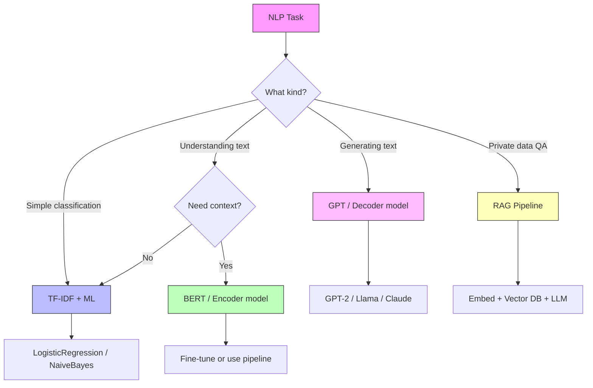

# NLP & LLMs — Cheatsheet

---

## NLP Pipeline

```
Raw Text → Tokenize → Clean (lower, stopwords, stem/lemma) → Vectorize → Model → Output
```

| Stage | What Happens | Tools |
|---|---|---|
| **Tokenize** | Split text into words/subwords | `nltk.word_tokenize`, `AutoTokenizer` |
| **Clean** | Lowercase, remove punctuation/stopwords | `nltk.corpus.stopwords`, `string.punctuation` |
| **Normalize** | Stemming or lemmatization | `PorterStemmer`, `WordNetLemmatizer` |
| **Vectorize** | Convert to numbers | `CountVectorizer`, `TfidfVectorizer`, embeddings |
| **Model** | Classification, generation, etc. | Logistic Regression → BERT → GPT |

---

## Text Representations — Comparison

| Method | Dims | Semantic? | Context-Aware? | Use Case |
|---|---|---|---|---|
| **Bag of Words** | vocab_size (sparse) | ✗ | ✗ | Simple counts, baselines |
| **TF-IDF** | vocab_size (sparse) | Partially | ✗ | Document classification, search |
| **Word2Vec** | 50-300 (dense) | ✓ | ✗ | Word similarity, analogy tasks |
| **GloVe** | 50-300 (dense) | ✓ | ✗ | Same as Word2Vec + global stats |
| **BERT embeddings** | 768 (dense) | ✓ | ✓ | Understanding tasks (NER, QA) |
| **GPT embeddings** | 768+ (dense) | ✓ | ✓ | Generation tasks |
| **Sentence Transformers** | 384-768 (dense) | ✓ | ✓ | Semantic search, similarity |

**TF-IDF formula:**
$$\text{TF-IDF}(t, d) = \text{TF}(t, d) \times \log\left(\frac{N}{\text{DF}(t)}\right)$$

---

## Transformer Architecture

### The Attention Formula

$$\text{Attention}(Q, K, V) = \text{softmax}\left(\frac{QK^T}{\sqrt{d_k}}\right) V$$

- **Q (Query):** what am I looking for?
- **K (Key):** what do I contain?
- **V (Value):** what information do I provide?
- **√d_k:** scaling factor to prevent extreme softmax values

### The Transformer Block

```
Input
  ↓
Multi-Head Attention → Add & LayerNorm (residual)
  ↓
Feed-Forward Network → Add & LayerNorm (residual)
  ↓
Output
```

### Encoder vs Decoder vs Encoder-Decoder

| Architecture | Attention | Best For | Models |
|---|---|---|---|
| **Encoder** | Bidirectional (sees all) | Classification, NER, QA | BERT, RoBERTa, DistilBERT |
| **Decoder** | Causal (sees past only) | Text generation, chat | GPT, Llama, Claude, Mistral |
| **Encoder-Decoder** | Cross-attention | Translation, summarization | T5, BART, mBART |

### Key Model Sizes

| Model | Parameters | Context |
|---|---|---|
| BERT-base | 110M | 512 tokens |
| DistilBERT | 66M | 512 tokens |
| GPT-2 | 1.5B | 1024 tokens |
| GPT-3 | 175B | 2048 tokens |
| GPT-4 | ~1.8T | 128K tokens |
| Llama 3 8B | 8B | 8K tokens |
| Llama 3 70B | 70B | 8K tokens |

---

## Hugging Face Quick Reference

### Pipeline API (fastest way)

```python
from transformers import pipeline

# Sentiment
pipe = pipeline('sentiment-analysis')
pipe("I love this!")  # → {'label': 'POSITIVE', 'score': 0.99}

# Generation
pipe = pipeline('text-generation', model='gpt2')
pipe("The future of AI", max_new_tokens=50, temperature=0.7)

# Summarization
pipe = pipeline('summarization', model='facebook/bart-large-cnn')
pipe(long_text, max_length=100)

# Question Answering
pipe = pipeline('question-answering')
pipe(question="Who?", context="...")

# NER
pipe = pipeline('ner', aggregation_strategy='simple')
pipe("Elon Musk founded SpaceX")

# Zero-shot Classification
pipe = pipeline('zero-shot-classification')
pipe("Stock market crashed", candidate_labels=["finance", "sports", "tech"])
```

### Common Model Classes

```python
from transformers import AutoTokenizer, AutoModel
from transformers import AutoModelForSequenceClassification
from transformers import AutoModelForTokenClassification
from transformers import AutoModelForCausalLM
from transformers import AutoModelForQuestionAnswering

tokenizer = AutoTokenizer.from_pretrained('bert-base-uncased')
model = AutoModelForSequenceClassification.from_pretrained('bert-base-uncased', num_labels=2)
```

### Fine-Tuning Pattern

```python
from transformers import Trainer, TrainingArguments

args = TrainingArguments(
    output_dir='./results',
    num_train_epochs=3,
    per_device_train_batch_size=8,
    eval_strategy='epoch',
)

trainer = Trainer(
    model=model,
    args=args,
    train_dataset=train_ds,
    eval_dataset=eval_ds,
    compute_metrics=compute_metrics,
)
trainer.train()
```

---

## RAG Architecture

```
┌─────────────────────────────────────────────────────┐
│                  INDEXING (offline)                   │
│  Documents → Chunk (500 tokens) → Embed → Vector DB  │
└─────────────────────────────────────────────────────┘

┌─────────────────────────────────────────────────────┐
│                  QUERY (online)                       │
│  Question → Embed → Search Vector DB → Top-K Chunks  │
│  → Format: [System + Context + Question]              │
│  → Send to LLM → Grounded Answer                     │
└─────────────────────────────────────────────────────┘
```

### RAG vs Fine-Tuning

| | RAG | Fine-Tuning |
|---|---|---|
| **When** | Access private/current data | Change model behavior/style |
| **Data** | Any documents (unstructured) | Labeled examples (hundreds+) |
| **Updates** | Update vector DB | Retrain model |
| **Hallucination** | Reduced (grounded) | Still possible |
| **Cost** | Retrieval + LLM tokens | GPU training time |

### Vector Databases

| DB | Type | Best For |
|---|---|---|
| FAISS | Library | Research, in-memory |
| ChromaDB | Lightweight | Prototyping |
| Pinecone | Cloud | Production |
| Weaviate | Self-hosted | Open-source production |
| pgvector | Postgres ext. | Already using Postgres |

---

## Prompt Engineering Patterns

| Technique | Pattern | When |
|---|---|---|
| **Zero-shot** | Just the instruction | Simple, well-defined tasks |
| **Few-shot** | 3-5 examples → then ask | Need consistent format/behavior |
| **Chain-of-thought** | "Let's think step by step" | Reasoning, math, multi-step |
| **System prompt** | Set role + constraints | Always (sets behavior) |

```python
# Zero-shot
"Classify this review as positive or negative: ..."

# Few-shot
"Review: 'Great!' → positive\nReview: 'Awful' → negative\nReview: '...' →"

# Chain-of-thought
"Classify this review. Think step by step:\n1. Identify positive words\n2. ..."

# System prompt
"[System] You are a sentiment classifier. Output only: positive/negative."
```

### OpenAI API Pattern

```python
from openai import OpenAI
client = OpenAI(api_key="...")

response = client.chat.completions.create(
    model="gpt-4",
    messages=[
        {"role": "system", "content": "You are a helpful assistant."},
        {"role": "user", "content": "Explain transformers in one paragraph."},
    ],
    temperature=0.7,
    max_tokens=200,
)
answer = response.choices[0].message.content
```

---

## Decision Flowchart — Which NLP Approach?



---

## Install Commands

```bash
# Core NLP
pip install nltk scikit-learn gensim

# Deep learning
pip install torch

# Hugging Face
pip install transformers datasets accelerate evaluate

# Sentence embeddings
pip install sentence-transformers

# LLM APIs
pip install openai

# LangChain + RAG
pip install langchain langchain-openai chromadb

# Vector search
pip install faiss-cpu  # or faiss-gpu
```

---

## Common Imports

```python
# Traditional NLP
import nltk
from nltk.tokenize import word_tokenize, sent_tokenize
from nltk.corpus import stopwords
from nltk.stem import PorterStemmer, WordNetLemmatizer
from sklearn.feature_extraction.text import CountVectorizer, TfidfVectorizer

# Word Embeddings
import gensim.downloader as api
from gensim.models import Word2Vec

# PyTorch
import torch
import torch.nn as nn
import torch.nn.functional as F

# Hugging Face
from transformers import pipeline
from transformers import AutoTokenizer, AutoModel
from transformers import AutoModelForSequenceClassification
from transformers import Trainer, TrainingArguments
from datasets import Dataset

# Visualization
import matplotlib.pyplot as plt
from sklearn.manifold import TSNE
from sklearn.decomposition import PCA
```
