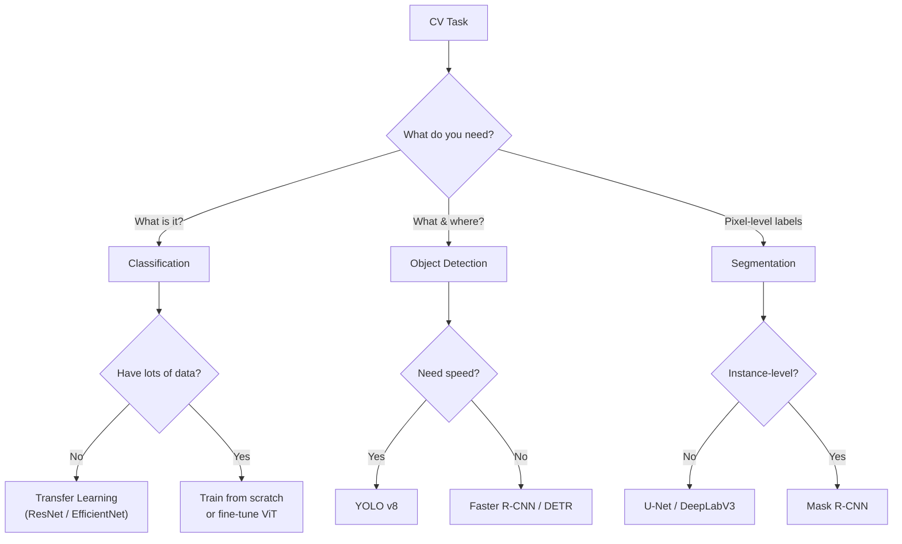

# 05 · Computer Vision — Cheatsheet

---

## Image Representation

| Format | Shape | Used By |
|--------|-------|---------|
| H × W × C | `(224, 224, 3)` | NumPy, PIL, OpenCV |
| **C × H × W** | `(3, 224, 224)` | **PyTorch** |

```python
# PIL → Tensor (also scales 0–255 → 0.0–1.0)
tensor = torchvision.transforms.ToTensor()(pil_image)

# Tensor → NumPy for display
np_img = tensor.permute(1, 2, 0).numpy()

# NumPy → Tensor manually
tensor = torch.from_numpy(np_img).permute(2, 0, 1).float() / 255.0
```

### ImageNet Normalization Values

| Channel | Mean  | Std   |
|---------|-------|-------|
| R       | 0.485 | 0.229 |
| G       | 0.456 | 0.224 |
| B       | 0.406 | 0.225 |

---

## torchvision.transforms — Common Transforms

```python
import torchvision.transforms as T

# Training pipeline (with augmentation)
train_transform = T.Compose([
    T.Resize(256),
    T.RandomCrop(224),
    T.RandomHorizontalFlip(),
    T.ColorJitter(brightness=0.2, contrast=0.2, saturation=0.2),
    T.ToTensor(),
    T.Normalize(mean=[0.485, 0.456, 0.406],
                std=[0.229, 0.224, 0.225]),
])

# Validation pipeline (deterministic)
val_transform = T.Compose([
    T.Resize(256),
    T.CenterCrop(224),
    T.ToTensor(),
    T.Normalize(mean=[0.485, 0.456, 0.406],
                std=[0.229, 0.224, 0.225]),
])
```

| Transform | What It Does |
|-----------|-------------|
| `T.Resize(256)` | Resize shortest edge to 256 |
| `T.RandomCrop(224)` | Random 224×224 crop |
| `T.CenterCrop(224)` | Deterministic center crop |
| `T.RandomHorizontalFlip()` | 50% chance mirror |
| `T.RandomRotation(15)` | Rotate ±15° |
| `T.ColorJitter(b, c, s, h)` | Random brightness, contrast, saturation, hue |
| `T.RandomErasing()` | Mask random rectangle |
| `T.ToTensor()` | PIL/ndarray → tensor, scale to [0, 1] |
| `T.Normalize(mean, std)` | Channel-wise normalization |

---

## CNN Building Blocks

### Output Size Formula

$$O = \frac{W - K + 2P}{S} + 1$$

Where: W = input size, K = kernel size, P = padding, S = stride

### Core Layers

```python
import torch.nn as nn

nn.Conv2d(in_channels=3, out_channels=32, kernel_size=3, padding=1)
nn.BatchNorm2d(32)
nn.ReLU(inplace=True)
nn.MaxPool2d(kernel_size=2, stride=2)   # halves spatial dims
nn.AdaptiveAvgPool2d((1, 1))            # any input → 1×1
nn.Dropout2d(0.25)
nn.Linear(in_features=512, out_features=10)
```

### Typical CNN Block

```python
def conv_block(in_ch, out_ch):
    return nn.Sequential(
        nn.Conv2d(in_ch, out_ch, 3, padding=1),
        nn.BatchNorm2d(out_ch),
        nn.ReLU(inplace=True),
        nn.MaxPool2d(2),
    )
```

---

## Transfer Learning Template

```python
import torchvision.models as models

# 1. Load pretrained model
model = models.resnet18(weights=models.ResNet18_Weights.DEFAULT)

# 2. Freeze all base layers
for param in model.parameters():
    param.requires_grad = False

# 3. Replace the classification head
model.fc = nn.Sequential(
    nn.Linear(model.fc.in_features, 256),
    nn.ReLU(),
    nn.Dropout(0.3),
    nn.Linear(256, num_classes),
)

# 4. Only optimize the new head
optimizer = torch.optim.Adam(model.fc.parameters(), lr=1e-3)

# 5. (Optional) Unfreeze later for fine-tuning
for param in model.parameters():
    param.requires_grad = True
optimizer = torch.optim.Adam(model.parameters(), lr=1e-5)  # lower LR!
```

---

## Common Pretrained Models

| Model | Params | Top-1 Acc (ImageNet) | Best For |
|-------|--------|---------------------|----------|
| ResNet18 | 11.7M | ~69.8% | Quick experiments, learning |
| ResNet50 | 25.6M | ~76.1% | Good baseline for most tasks |
| EfficientNet-B0 | 5.3M | ~77.1% | Mobile / edge deployment |
| EfficientNet-B4 | 19.3M | ~82.9% | High accuracy, moderate compute |
| ViT-B/16 | 86.6M | ~81.1% | When you have lots of data |
| ConvNeXt-T | 28.6M | ~82.1% | Modern CNN alternative to ViT |

---

## Object Detection

### IoU (Intersection over Union)

$$\text{IoU} = \frac{\text{Area of Overlap}}{\text{Area of Union}}$$

```python
def iou(box1, box2):
    x1 = max(box1[0], box2[0])
    y1 = max(box1[1], box2[1])
    x2 = min(box1[2], box2[2])
    y2 = min(box1[3], box2[3])

    intersection = max(0, x2 - x1) * max(0, y2 - y1)
    area1 = (box1[2] - box1[0]) * (box1[3] - box1[1])
    area2 = (box2[2] - box2[0]) * (box2[3] - box2[1])
    union = area1 + area2 - intersection

    return intersection / union if union > 0 else 0.0
```

### Non-Max Suppression (NMS)

1. Sort detections by confidence score (descending)
2. Take the highest-confidence box, add to results
3. Remove all remaining boxes with IoU > threshold (e.g., 0.5) against the kept box
4. Repeat until no boxes remain

```python
from torchvision.ops import nms
keep = nms(boxes, scores, iou_threshold=0.5)
```

### Detection Architectures

| Family | Speed | Accuracy | Key Idea |
|--------|-------|----------|----------|
| R-CNN → Fast → Faster R-CNN | Slow → Fast | High | Region proposals + classify |
| SSD | Fast | Medium | Multi-scale feature maps |
| YOLO (v5–v8) | Very Fast | High | Single-pass grid prediction |
| DETR | Medium | High | Transformer-based, no anchors |

---

## Decision Flowchart


