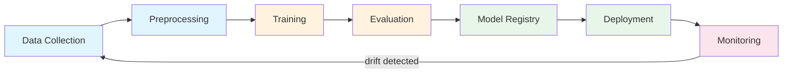

# 06 — MLOps Cheatsheet

---

## Model Serialization

| Format | Best For | Pros | Cons |
|---|---|---|---|
| **pickle** | Quick prototyping | Built-in, works on any Python object | Not secure, Python-version-sensitive |
| **joblib** | sklearn models | Efficient for large NumPy arrays, compression | Same security issues as pickle |
| **torch.save** | PyTorch models | Native PyTorch, saves state_dict or full model | Tied to PyTorch version |
| **ONNX** | Cross-framework deployment | Framework-agnostic, optimized runtimes | Export can be tricky for complex architectures |

```python
# joblib (sklearn)
import joblib
joblib.dump(model, "model.pkl")
model = joblib.load("model.pkl")

# torch
torch.save(model.state_dict(), "model.pt")
model.load_state_dict(torch.load("model.pt", weights_only=True))

# ONNX export (from PyTorch)
torch.onnx.export(model, dummy_input, "model.onnx")
```

---

## FastAPI ML Serving Template

```python
from fastapi import FastAPI
from pydantic import BaseModel, Field
import joblib
import numpy as np

app = FastAPI(title="ML API")
model = joblib.load("model.pkl")


class Features(BaseModel):
    feature_1: float = Field(..., gt=0)
    feature_2: float = Field(..., gt=0)


class Prediction(BaseModel):
    predicted_class: int
    confidence: float


@app.get("/health")
def health():
    return {"status": "healthy"}


@app.post("/predict", response_model=Prediction)
def predict(features: Features):
    X = np.array([[features.feature_1, features.feature_2]])
    proba = model.predict_proba(X)[0]
    idx = int(np.argmax(proba))
    return Prediction(predicted_class=idx, confidence=float(proba[idx]))
```

Run: `uvicorn app:app --host 0.0.0.0 --port 8000`

---

## Dockerfile Template for ML Apps

```dockerfile
FROM python:3.11-slim

WORKDIR /app

COPY requirements.txt .
RUN pip install --no-cache-dir -r requirements.txt

COPY app.py .
COPY model.pkl .

EXPOSE 8000

CMD ["uvicorn", "app:app", "--host", "0.0.0.0", "--port", "8000"]
```

```bash
docker build -t ml-api .
docker run -p 8000:8000 ml-api
```

---

## MLflow Quick Reference

```python
import mlflow

mlflow.set_experiment("my-experiment")

with mlflow.start_run(run_name="experiment-1"):
    # Parameters
    mlflow.log_param("learning_rate", 0.01)
    mlflow.log_param("n_estimators", 100)

    # Metrics
    mlflow.log_metric("accuracy", 0.95)
    mlflow.log_metric("f1", 0.93)

    # Artifacts (files)
    mlflow.log_artifact("confusion_matrix.png")

    # Model
    mlflow.sklearn.log_model(model, "model")

# Compare runs
runs = mlflow.search_runs(experiment_ids=["1"])
best = runs.sort_values("metrics.accuracy", ascending=False).iloc[0]

# Load best model
model = mlflow.sklearn.load_model(f"runs:/{best.run_id}/model")

# Model Registry
mlflow.register_model(f"runs:/{best.run_id}/model", "my-model")
```

Launch UI: `mlflow ui --port 5000`

---

## sklearn Pipeline Template

```python
from sklearn.pipeline import Pipeline
from sklearn.compose import ColumnTransformer
from sklearn.preprocessing import StandardScaler, OneHotEncoder
from sklearn.impute import SimpleImputer
from sklearn.ensemble import RandomForestClassifier

num_cols = ["age", "income"]
cat_cols = ["city", "gender"]

preprocessor = ColumnTransformer([
    ("num", Pipeline([
        ("imputer", SimpleImputer(strategy="median")),
        ("scaler", StandardScaler()),
    ]), num_cols),
    ("cat", Pipeline([
        ("imputer", SimpleImputer(strategy="most_frequent")),
        ("encoder", OneHotEncoder(handle_unknown="ignore")),
    ]), cat_cols),
])

pipeline = Pipeline([
    ("preprocess", preprocessor),
    ("classifier", RandomForestClassifier(n_estimators=200)),
])

pipeline.fit(X_train, y_train)
predictions = pipeline.predict(X_test)
```

---

## CI/CD Workflow Template (GitHub Actions)

```yaml
name: ML Pipeline

on:
  push:
    branches: [main]

jobs:
  test-and-train:
    runs-on: ubuntu-latest
    steps:
      - uses: actions/checkout@v4

      - uses: actions/setup-python@v5
        with:
          python-version: "3.11"

      - run: pip install -r requirements.txt

      - name: Run tests
        run: pytest tests/ -v

      - name: Train model
        run: python train.py

      - name: Upload model
        uses: actions/upload-artifact@v4
        with:
          name: trained-model
          path: model.pkl
```

---

## MLOps Lifecycle



| Stage | Key Tools |
|---|---|
| Data Collection | DVC, S3, databases |
| Preprocessing | sklearn Pipeline, pandas |
| Training | sklearn, PyTorch, XGBoost |
| Evaluation | pytest, cross-validation |
| Model Registry | MLflow Registry |
| Deployment | Docker, FastAPI, Cloud Run |
| Monitoring | Evidently, custom scripts |

---

## Deployment Options Comparison

| Option | Complexity | Scalability | Cost | Best For |
|---|---|---|---|---|
| **localhost** | ★☆☆ | None | Free | Development and testing |
| **Docker** | ★★☆ | Manual | Free locally | Reproducible environments |
| **Cloud Run / ECS** | ★★☆ | Auto-scaling | Pay-per-use | Production APIs |
| **SageMaker / Vertex AI** | ★★★ | Managed | Higher | Full ML lifecycle |
| **Lambda / Cloud Functions** | ★★☆ | Auto-scaling | Per-invocation | Lightweight, sporadic traffic |
| **Kubernetes** | ★★★ | Full control | Variable | Large-scale, multi-model |

**Decision guide:**
- Just testing? → `uvicorn app:app --reload`
- Sharing with team? → Docker
- Need production reliability? → Cloud Run or ECS
- Full ML platform? → SageMaker or Vertex AI
- Sporadic traffic, simple model? → Lambda / Cloud Functions
